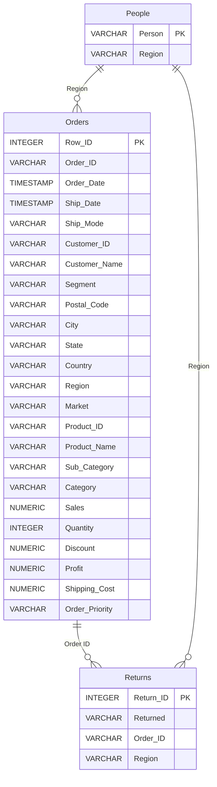

# Data Model: Data and GenAI Platform – Baseline

**Feature**: 001-data-genai-platform-baseline
**Date**: 2026-07-30
**Source**: Derived from EDA on `Global Superstore Data.xlsx` (see [research.md](./research.md) Part A)

> All PostgreSQL types below are **derived from the EDA**, not hardcoded upfront. Engine-specific DDL rendering lives in the PostgreSQL adapter (`src/data_access/adapters/postgres/`); the `data-model.md` defines the engine-neutral `LogicalType` per column, and the PG type is shown here as the concrete local-dev materialization. The future BigQuery adapter will map the same `LogicalType` values to BigQuery types (e.g., `INTEGER → INT64`, `DECIMAL(p,s) → NUMERIC`, `VARCHAR → STRING`, `TIMESTAMP → TIMESTAMP`).

## Entities

### 1. `Orders` — Transactional Logs

The transactional fact table: one row per order line. Central to the future v1.0/1.1 Text-to-SQL scope and v2.0 business logic (gross/net sales).

**Primary key**: `Row ID` (EDA-confirmed unique, integer-like, non-null across all 51,290 rows).

| # | Column | LogicalType | PostgreSQL type | Null | PK/FK | EDA evidence & rule |
|---|---|---|---|---|---|---|
| 1 | `Row ID` | INTEGER | INTEGER | NO | **PK** | 51,290 unique non-null integers, range 1–51,290 |
| 2 | `Order ID` | STRING | VARCHAR(50) | NO | — | 25,728 unique (one order = multiple line items); free-text ID e.g. `CA-2016-PJ19015140-42572` |
| 3 | `Order Date` | TIMESTAMP | TIMESTAMP | NO | — | datetime64[us]; range 2014-01-01 → 2017-12-31 |
| 4 | `Ship Date` | TIMESTAMP | TIMESTAMP | NO | — | datetime64[us]; range 2014-01-03 → 2018-01-07; always ≥ Order Date |
| 5 | `Ship Mode` | STRING(enum) | VARCHAR(20) | NO | — | 4 values: Standard Class, Second Class, First Class, Same Day |
| 6 | `Customer ID` | STRING | VARCHAR(50) | NO | — | 17,415 unique |
| 7 | `Customer Name` | STRING | VARCHAR(100) | NO | — | 796 unique names (normalized at load: strip non-breaking spaces) |
| 8 | `Segment` | STRING(enum) | VARCHAR(20) | NO | — | 3 values: Home Office, Consumer, Corporate |
| 9 | `Postal Code` | STRING | VARCHAR(20) | YES | — | **80% NULL** (only US/Canada rows); nullable. Stored as VARCHAR (leading zeros / format preserved), NOT numeric |
| 10 | `City` | STRING | VARCHAR(100) | NO | — | 3,650 unique |
| 11 | `State` | STRING | VARCHAR(100) | NO | — | 1,106 unique |
| 12 | `Country` | STRING | VARCHAR(100) | NO | — | 165 unique |
| 13 | `Region` | STRING | VARCHAR(50) | NO | **FK-like → People.Region** | 23 unique; shared with Returns & People. VARCHAR (NOT enum) due to People-vs-Orders region taxonomy mismatch (see research.md C) |
| 14 | `Market` | STRING(enum) | VARCHAR(20) | NO | — | 5 values: Asia Pacific, Europe, Africa, LATAM, USCA |
| 15 | `Product ID` | STRING | VARCHAR(50) | NO | — | 3,788 unique |
| 16 | `Product Name` | STRING | VARCHAR(300) | NO | — | 3,788 unique; long free-text |
| 17 | `Sub-Category` | STRING(enum) | VARCHAR(30) | NO | — | 17 values |
| 18 | `Category` | STRING(enum) | VARCHAR(30) | NO | — | 3 values: Furniture, Office Supplies, Technology |
| 19 | `Sales` | DECIMAL(12,4) | NUMERIC(12,4) | NO | — | Money; range 0.444 → 22,638.48. `Decimal` in Pydantic, NOT float |
| 20 | `Quantity` | INTEGER | INTEGER | NO | — | Range 1 → 14 |
| 21 | `Discount` | DECIMAL(5,4) | NUMERIC(5,4) | NO | — | Fractional 0.0 → 0.85; irregular values like 0.402, 0.002 present (kept as-is). `Decimal`, NOT float |
| 22 | `Profit` | DECIMAL(12,4) | NUMERIC(12,4) | NO | — | Money, signed; range -6,599.978 → 8,399.976 (negatives allowed). `Decimal`, NOT float |
| 23 | `Shipping Cost` | DECIMAL(10,4) | NUMERIC(10,4) | NO | — | Money; range 1.002 → 933.57. `Decimal`, NOT float |
| 24 | `Order Priority` | STRING(enum) | VARCHAR(20) | NO | — | 4 values: Medium, High, Low, Critical |

**Validation rules**:
- `Ship Date >= Order Date` (business invariant; load MUST validate).
- `Quantity >= 1`.
- `Sales >= 0`; `Shipping Cost >= 0`; `Discount` in `[0.0, 1.0]` (EDA max is 0.85, but allow headroom).
- `Postal Code` MAY be NULL; all other columns are NOT NULL (EDA confirmed 0 nulls except Postal Code).

### 2. `Returns` — Reverse Logistics

Records which orders were returned.

**Primary key**: surrogate `Return ID` (EDA found 63 duplicate `Order ID` values across 2,033 rows → `Order ID` alone is NOT unique; multi-line returns exist).

| # | Column | LogicalType | PostgreSQL type | Null | PK/FK | EDA evidence & rule |
|---|---|---|---|---|---|---|
| 1 | `Return ID` | INTEGER | SERIAL (INTEGER) | NO | **PK** | Surrogate — row-ordinal assigned at load (1..2033). Introduced because `Order ID` has 63 duplicates |
| 2 | `Returned` | STRING(enum) | VARCHAR(5) | NO | — | Degenerate: always `"Yes"` (1 unique value). Loaded for fidelity; presence of the row = "returned" |
| 3 | `Order ID` | STRING | VARCHAR(50) | NO | **FK-like → Orders.Order ID** | 1,970 unique of 2,033 rows; 1,970 overlap with Orders.Order ID confirmed |
| 4 | `Region` | STRING | VARCHAR(50) | NO | **FK-like → People.Region** | 23 unique; shared with Orders & People |

**Validation rules**:
- `Order ID` is non-unique (duplicates allowed; not a PK). Index it for join performance.
- Every `Returns.Order ID` value MUST exist in `Orders.Order ID` (referential integrity — 1,970 confirmed overlap).
- `Returned` MUST be `"Yes"` (load SHOULD warn/fail if another value appears — would indicate source-data drift).

### 3. `People` — Sales Governance

Mapping of regional sales people to the regions they govern. Basis for future v2.0 Row-Level Security.

**Primary key**: `Person` (EDA-confirmed unique, non-null across all 24 rows).

| # | Column | LogicalType | PostgreSQL type | Null | PK/FK | EDA evidence & rule |
|---|---|---|---|---|---|---|
| 1 | `Person` | STRING | VARCHAR(100) | NO | **PK** | 24 unique. **Normalize non-breaking spaces (`\xa0` → space) at load** (e.g., `"Andile\xa0Ihejirika"` → `"Andile Ihejirika"`) |
| 2 | `Region` | STRING | VARCHAR(50) | NO | — (future RLS anchor) | 24 unique (People splits Canada into Eastern/Western; 22 of 24 overlap with Orders). VARCHAR, NOT enum |

**Validation rules**:
- `Person` MUST be unique and non-null (PK).
- `Person` MUST be normalized (strip `\xa0`, strip leading/trailing whitespace) at load time so v2.0 RLS-by-person doesn't silently miss matches.
- `Region` taxonomy mismatch with Orders (`Eastern Canada`/`Western Canada` in People vs `Canada` in Orders) is **documented, not resolved** at this baseline — resolution is v2.0 Semantic-Layer scope.

## Relationships

**Relationship rules** (enforced by the loader; PostgreSQL FKs are optional at this baseline but recommended):

- `Returns.Order ID` → `Orders.Order ID` (many returns may reference one order; confirms a return refers to an order).
- `People.Region` → `Orders.Region` (regional sales-person governs rows in Orders — future v2.0 RLS anchor).
- `People.Region` → `Returns.Region` (same governance applies to returns).

> **Note on FK enforcement**: PostgreSQL `FOREIGN KEY` constraints are allowed at this baseline (they live in the PG adapter's DDL, which is engine-specific by design). However, since BigQuery does not support FKs, the *typed contracts* and *loader validation* (FR-015) are the engine-neutral mechanism that guarantees referential integrity — the PG FKs are defence-in-depth, not the only enforcement.

## State Transitions

Not applicable at this baseline — the warehouse is loaded once per bootstrap from a static Excel source. There is no row-level state machine (`Returned` is a static flag, not a transition). Future v2.0 Semantic-Layer business logic (net vs gross sales) will derive state from the `Returns`/`Orders` join.

## Governance-Readiness (for v2.0, not implemented now)

The data model is designed to *trivially admit* future governance without carrying it now:

- **RLS anchor**: `Orders.Region` and `Returns.Region` are preserved as first-class columns → v2.0 can scope rows by joining to `People.Region` at the Semantic Layer.
- **Business-logic ingredients**: `Returns.Order ID` ↔ `Orders.Order ID` is preserved → v2.0 can compute net sales = gross sales − returned sales.
- **Person scoping**: `People.Person` is the PK and is normalized at load → v2.0 RLS-by-person is straightforward.

Per the spec and constitution Principle IV, **no RBAC/RLS logic is implemented in this baseline** — the data model merely preserves the columns needed for it later.
