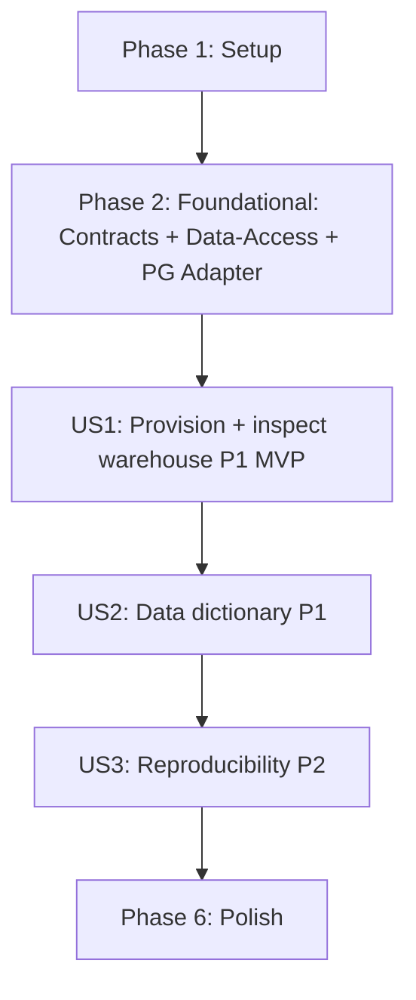

# Tasks: Data and GenAI Platform – Baseline

**Input**: Design documents from `/specs/001-data-genai-platform-baseline/`

**Prerequisites**: plan.md (required), spec.md (required for user stories), research.md, data-model.md, contracts/

**Tests**: The constitution (v1.0.0, "Development Workflow & Quality Gates") mandates contract tests at every cross-layer/cross-domain boundary and integration tests against the Dockerized PostgreSQL. Only these constitution-required tests are included below; no separate TDD request is assumed.

**Organization**: Tasks are grouped by user story to enable independent implementation and testing of each story. Scope is strictly the baseline (v0): local PostgreSQL via Docker, database initialization, Python ingestion of the Excel file, and Data Dictionary generation. Text-to-SQL (v1.0/1.1) and Semantic Layer/RLS (v2.0) are explicitly excluded.

## Format: `[ID] [P?] [Story] Description`

- **[P]**: Can run in parallel (different files, no dependencies on incomplete tasks)
- **[Story]**: Which user story this task belongs to (US1, US2, US3)
- Include exact file paths in descriptions

## Path Conventions

Single project layout per `plan.md` § Project Structure: `src/`, `tests/`, `docker/` at repository root.

---

## Phase 1: Setup (Shared Infrastructure)

**Purpose**: Project initialization, Docker service, and tooling configuration

- [X] T001 Create Python project structure and `pyproject.toml` (uv-managed, `requires-python = ">=3.11"`; deps: `psycopg[binary]`, `pandas`, `openpyxl`, `pydantic` v2, `pytest`, `mypy`; commit `uv.lock`) in `pyproject.toml` and create `src/`, `tests/`, `docker/`, `src/contracts/`, `src/data_engineering/`, `src/data_access/`, `src/cli/` package tree with `__init__.py` files
- [X] T002 [P] Create PostgreSQL Docker Compose service in `docker/docker-compose.yml` (PostgreSQL 15+, dedicated database/schema distinct from default `postgres`, healthcheck, named volume) per FR-001/FR-002/FR-017
- [X] T003 [P] Configure externalized environment + tooling baseline in `.env.example` (host, port, database name, user, password per FR-006), `.gitignore` (exclude `.env`, `__pycache__`, `.venv/`), and `mypy.ini`/`pyproject` strict-typing config (Pyright/Pylance strict or `mypy --strict`, zero errors) per constitution Principle I

**Checkpoint**: Project skeleton ready; Docker + tooling configured

---

## Phase 2: Foundational (Blocking Prerequisites)

**Purpose**: Core typed contracts + data-access layer that ALL user stories depend on

**⚠️ CRITICAL**: No user story work can begin until this phase is complete

- [X] T004 [P] Define Pydantic v2 data-access contract models in `src/contracts/data_access.py` (`LogicalType` enum, `ColumnDef`, `TableDef`, `ForeignKeyDef`, `OrderRow`, `ReturnRow`, `PersonRow`, `LoadResult`) per `contracts/data_access.md` and `data-model.md` (money fields as `Decimal` NOT `float`; `OrderRow.postal_code: str | None`; `ReturnRow` no PK on `Order ID`)
- [X] T005 [P] Define Pydantic v2 ingestion contract models in `src/contracts/ingestion.py` (`ColumnProfile`, `TableProfile`, `SchemaInferenceResult`, `SharedColumn`, `LoadArtifactManifest`, `TableLoadSummary`) per `contracts/ingestion.md`
- [X] T006 [P] Define Pydantic v2 dictionary contract models in `src/contracts/dictionary.py` (`KaggleSemanticSource`, `TableSemantic`, `ColumnSemantic`, `DictionaryEntry`, `TableDictionary`, `RelationshipEntry`, `DataDictionaryDocument`) per `contracts/dictionary.md`
- [X] T007 Define typed Protocol interfaces in `src/data_access/interfaces.py` (`SchemaProvider`, `DataProvider` with `load_rows`/`find_orders_by_region`/`count_rows`/`list_tables`, `QueryProvider` stub) using `typing.Protocol` + `@runtime_checkable`; methods typed to return/accept contract models — no `execute_sql` escape hatch per `contracts/data_access.md` and research.md § Risks
- [X] T008 Implement PostgreSQL adapter in `src/data_access/adapters/postgres/connection.py` (psycopg v3 sync connection from env config) and `src/data_access/adapters/postgres/repository.py` (implements Protocols: `create_table` via `psycopg.sql`, `drop_table`, `table_exists`, `load_rows` bulk-load semantic via `COPY`/batch, `count_rows`, `list_tables`; row_factory→dict_row→`model_validate`) — engine-specific code confined here per constitution Principle III
- [X] T009 [P] Contract test for architecture boundary enforcement in `tests/contract/test_boundaries.py` (asserts: no `pandas`/`openpyxl` imports outside `src/data_engineering/eda|ingestion`; no `psycopg` imports outside `src/data_access/adapters/postgres`; all Protocol methods typed to contract models, never `Any`/`dict`) — constitution-mandated gate

**Checkpoint**: Typed contracts + data-access layer + boundary enforcement ready; user story implementation can now begin in parallel

---

## Phase 3: User Story 1 - Provision and inspect the local Data Warehouse (Priority: P1) 🎯 MVP

**Goal**: A running, containerized PostgreSQL warehouse with the three Global Superstore tables (`Orders`, `Returns`, `People`) populated from `Global Superstore Data.xlsx`, queryable via documented credentials, with bootstrap/teardown/validate commands.

**Independent Test**: Run `bootstrap` → connect to PostgreSQL → `SELECT count(*) FROM orders; / returns; / people;` returns 51,290 / 2,033 / 24 non-zero rows.

### Implementation for User Story 1

- [X] T010 [P] [US1] Implement Excel EDA explorer in `src/data_engineering/eda/explorer.py` (pandas `read_excel` over `Global Superstore Data.xlsx`; per-sheet profiling → `list[TableProfile]` with dtype, non-null, null, unique, sample values, min/max, PK candidates, duplicate counts; detect 80% null `Postal Code` and 63 duplicate `Order ID` in Returns) per research.md Part A
- [X] T011 [P] [US1] Implement schema inferrer in `src/data_engineering/eda/schema_inferrer.py` (`TableProfile` → `TableDef`/`ColumnDef` with `LogicalType`: money→`DECIMAL(p,s)`, IDs/Quantity→`INTEGER`, dates→`TIMESTAMP`, enum-like→`STRING` with `allowed_values`; PK: `Row ID` for Orders, surrogate `Return ID` for Returns, `Person` for People; FK-like relationships: Returns.Order ID→Orders, People.Region→Orders/Returns) per data-model.md
- [X] T012 [US1] Implement ingestion loader in `src/data_engineering/ingestion/loader.py` (pandas `astype` nullable dtypes → `TypeAdapter(list[Row]).validate_python` → `DataProvider.load_rows`; normalize `People.Person` non-breaking spaces `\xa0`→space; `Returns.Return ID` surrogate assignment; fail fast with offending-row path on validation error, no partial load) per FR-013/FR-015 and research.md Part B
- [X] T013 [US1] Implement load manifest provenance writer in `src/data_engineering/ingestion/manifest.py` (writes `LoadArtifactManifest` JSON: source-file `sha256`, schema version, per-table row counts, git commit, tool versions, timestamp; row-count reconciliation against EDA counts) per research.md "Minimal MLOps Footprint"
- [X] T014 [US1] Implement `bootstrap` CLI command in `src/cli/main.py` (fail fast if Docker unavailable / port taken / source `.xlsx` missing or corrupt per FR-013; `docker compose up` → wait for PG healthcheck → run EDA → `SchemaProvider.create_table` per inferred TableDef → `load_rows` → write manifest; `uv run python -m src.cli.main bootstrap`) per quickstart.md § Setup
- [X] T015 [US1] Implement `teardown` CLI command in `src/cli/main.py` (stop + remove container; optionally remove volume; warn/forcibly disconnect active SQL sessions; no orphaned Docker resources per FR-007/SC-006; `uv run python -m src.cli.main teardown`)
- [X] T016 [US1] Implement `validate` CLI command in `src/cli/main.py` (single pass/fail: container up, DB reachable, exactly `Orders`/`Returns`/`People` present, row counts 51,290 / 2,033 / 24, dictionary file present; exit code 0 on pass within 30s per FR-014/SC-007)
- [X] T017 [P] [US1] Contract test for data-access Protocol conformance in `tests/contract/test_data_access.py` (`runtime_checkable` conformance of PG adapter; every public Protocol method typed to return/accept Pydantic contract models; `load_rows` rejects untyped/partial payloads) — constitution-mandated
- [X] T018 [US1] Integration test for warehouse provisioning in `tests/integration/test_warehouse.py` (runs `bootstrap` against the Dockerized PostgreSQL — no mocks; asserts 3 tables present with expected row counts 51,290 / 2,033 / 24) — constitution-mandated

**Checkpoint**: US1 fully functional — a queryable local warehouse; MVP demonstrated

---

## Phase 4: User Story 2 - Read the data dictionary to understand the warehouse (Priority: P1)

**Goal**: A comprehensive `data_dictionary.md` integrating Kaggle semantics (Orders: Transactional Logs; Returns: Reverse Logistics; People: Sales Governance) with EDA-discovered types, covering 100% of tables and columns, regeneratable via CLI.

**Independent Test**: Open `data_dictionary.md` → confirm three table sections, one entry per column (name, business description, type, nullable, key flag, allowed values, data-quality notes); a new reader answers "what does `Discount` mean and what values can it hold?" using only the doc.

### Implementation for User Story 2

- [X] T019 [P] [US2] Implement Kaggle semantic source in `src/data_engineering/dictionary/semantic_source.py` (curated `KaggleSemanticSource`: Orders=Transactional Logs, Returns=Reverse Logistics, People=Sales Governance; per-table purpose + per-column business descriptions + key-kind flags per `contracts/dictionary.md`)
- [X] T020 [US2] Implement dictionary generator in `src/data_engineering/dictionary/generator.py` (merge `SchemaInferenceResult` + `KaggleSemanticSource` → `DataDictionaryDocument`; attach data-quality notes from research.md A.4: 80% null Postal Code, signed Profit, degenerate `Returned`=Yes, 63 dup Returns Order ID, People non-breaking spaces, Region taxonomy mismatch) per FR-008/FR-009/FR-010/FR-011
- [X] T021 [US2] Render committed `data_dictionary.md` artifact at repository root (three Kaggle-labeled table sections; per-table column table with name/business description/`LogicalType`+PostgreSQL type/nullable/key/allowed values/DQ notes; relationships block documenting `Returns.Order ID → Orders.Order ID`, `People.Region → Orders/Returns.Region`) per FR-008/FR-009/FR-010/FR-011/SC-004
- [X] T022 [US2] Implement `generate-dictionary` CLI command in `src/cli/main.py` (consume EDA inference + semantic source → render `DataDictionaryDocument` → write `data_dictionary.md`; regeneratable on a fresh machine from the loaded schema per FR-012; `uv run python -m src.cli.main generate-dictionary`)
- [X] T023 [P] [US2] Contract test for dictionary generation in `tests/contract/test_dictionary.py` (asserts `DataDictionaryDocument` covers exactly 3 tables + 100% of columns; every `DictionaryEntry` has name, business_description, type, nullable, is_key; `RelationshipEntry` includes all 3 cross-table links) — constitution-mandated

**Checkpoint**: US2 fully functional — a readable, regeneratable data dictionary

---

## Phase 5: User Story 3 - Validate reproducibility of the baseline environment (Priority: P2)

**Goal**: Any contributor reproduces the full baseline (warehouse + dictionary) from a clean clone with a single documented procedure, deterministically.

**Independent Test**: Delete the running environment + local state → re-run `bootstrap` → `validate` → identical schema and row counts (100% reproducibility per SC-003).

### Implementation for User Story 3

- [X] T024 [US3] Wire `LoadArtifactManifest` provenance into the `validate` command in `src/cli/main.py` (verify `source_sha256` matches `Global Superstore Data.xlsx` hash and `rows_loaded` per table matches EDA-derived counts 51,290 / 2,033 / 24; surface provenance as a validation check) per FR-014/SC-007
- [X] T025 [US3] Implement reproducibility validation in `src/data_engineering/validation/validator.py` (deterministic re-bootstrap path: `teardown` → `bootstrap` → `validate`; assert identical schema + row counts across runs; detect any schema drift across re-runs per FR-005/SC-003)
- [X] T026 [US3] Document baseline usage + clean-clone bootstrap in `README.md` (prerequisites: Docker + `uv`; one-command `uv sync` → `uv run python -m src.cli.main bootstrap|validate|teardown|generate-dictionary`; expected outputs and row counts per FR-016; reference `quickstart.md`)
- [X] T027 [P] [US3] Integration test for reproducibility in `tests/integration/test_reproducibility.py` (runs `teardown` → `bootstrap` → `validate` against Dockerized PG — no mocks; asserts identical schema and row counts 51,290 / 2,033 / 24 across two runs) — constitution-mandated

**Checkpoint**: US3 fully functional — deterministic reproduction from a clean clone verified

---

## Phase 6: Polish & Cross-Cutting Concerns

**Purpose**: Final quality gates spanning all stories

- [X] T028 [P] Run `quickstart.md` end-to-end validation (check A: environment+load, B: queryable spot-check via psql counts, C: dictionary readable, D: reproducibility teardown→re-bootstrap) per quickstart.md and SC-001/SC-002
- [X] T029 [P] Final strict type-check pass (Pyright/Pylance strict or `mypy --strict`, zero errors) across `src/` and `tests/` per constitution Principle I and Dev Workflow Quality Gates
- [X] T030 [P] Finalize documentation cross-references in `specs/001-data-genai-platform-baseline/` and root `README.md` (ensure `.env.example` documents all config vars per FR-006; link `plan.md` ↔ `quickstart.md` ↔ `data-model.md` ↔ `contracts/`)

---

## Dependencies

**Story completion order** (MVP first, incremental delivery):

- **Phase 2 is a hard gate**: US1, US2, US3 all depend on the typed contracts (T004–T006) and the data-access Protocols + PG adapter (T007–T008).
- **US1 → US2**: US2's dictionary generator consumes the `SchemaInferenceResult` that US1's EDA pipeline (T010/T011) produces.
- **US2 → US3**: US3's `validate` command checks the dictionary file presence (T024) — requires the dictionary (T021) to exist.
- **US1 and US2 internal tasks** are largely parallel within each story (see "Parallel Execution" below).

## Parallel Execution Examples

### Within US1 (after Phase 2 gate)
- **Parallel batch A** (different files, no inter-dependency): T010 (EDA explorer) ∥ T011 (schema inferrer).
- **Sequential after A**: T012 (loader) depends on T010 + T011 + T008 (PG adapter); T013 (manifest) depends on T012.
- **Parallel batch B**: T017 (contract test) ∥ T018 (integration test) — both depend only on T008/T010–T016 being structurally present.
- **Sequential CLI tasks**: T014 (bootstrap) → T015 (teardown) → T016 (validate) share `src/cli/main.py` and are best done in sequence.

### Within US2 (after US1's EDA/schema inference exist)
- **Parallel batch**: T019 (Kaggle semantic source) ∥ T023 (dictionary contract test) — T023 depends only on contract models (T006) + T019/T020 being structurally present.
- **Sequential**: T020 (generator, depends on T019) → T021 (render doc) → T022 (CLI).

### Within US3
- **Parallel batch**: T026 (README docs) ∥ T027 (reproducibility integration test).

## Implementation Strategy

**MVP first**: US1 alone delivers the first demonstrated value (a queryable local warehouse). It is the recommended single-story MVP scope.

**Incremental delivery**: US2 amplifies US1 (documented semantics), and US3 locks in determinism for everyone else. Each story is independently testable via its Independent Test.

**Architecture adherence**: Every implementation task MUST keep engine-specific code confined to `src/data_access/adapters/postgres/` (constitution Principle III), type every signature (Principle I), and route all cross-domain traffic through the typed contracts in `src/contracts/` (Principle II). No Text-to-SQL or RLS/governance logic is introduced (correctly deferred to v1.0/1.1 and v2.0 per spec).

**Excluded from this baseline (explicitly)**: Text-to-SQL on `Orders` (v1.0/1.1), Semantic Layer + business logic on `Returns` + Row-Level Security on `People` (v2.0), BigQuery adapter implementation, MLflow/DVC experiment tracking, dashboard UI. These appear only as roadmap context in `spec.md`/`research.md`, never as tasks here.

## Done When

- [ ] `tasks.md` generated with all phases, task IDs, `[P]` markers, and exact file paths
- [ ] Extension hooks dispatched or skipped according to the rules (`.specify/extensions.yml` does not exist → skipped)
- [ ] Completion reported to user with task count, story breakdown, and MVP scope
