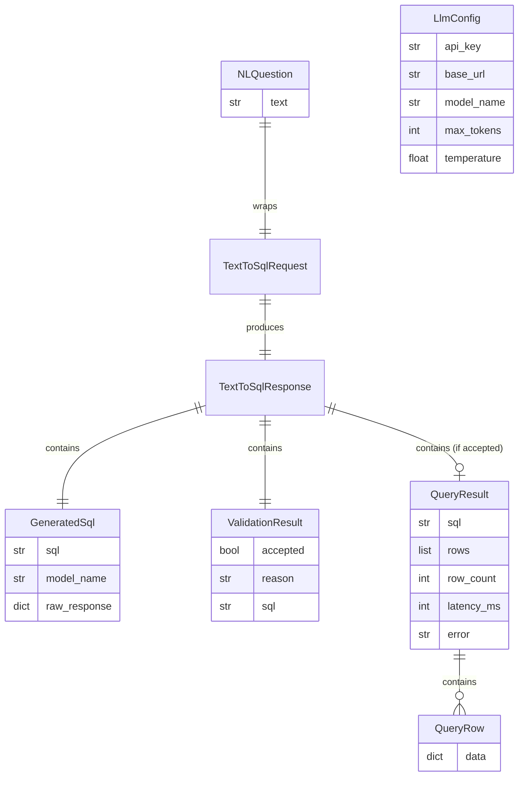

# Data Model: Text-to-SQL v1.0 / v1.1

**Feature**: 002-text-to-sql-v1
**Date**: 2026-08-11
**Source**: Derived from `plan.md` Technical Context + `research.md` Parts A–E

> This data model defines the **AI Engineering contract models** (Pydantic v2) that flow through the Text-to-SQL pipeline. It does NOT modify the existing data-access contracts (`data_access.py`, `ingestion.py`, `dictionary.py`) — those remain unchanged. The only extension to the baseline is the `QueryProvider` Protocol gaining `execute_readonly_query` (see [contracts/text_to_sql.md](./contracts/text_to_sql.md)).

## Entities (AI Engineering Contracts)

All models live in `src/contracts/text_to_sql.py` (Pydantic v2).

### 1. `LlmConfig`

Configuration for the LLM client, loaded from environment variables.

| Field | Type | Env var | Default | Notes |
|---|---|---|---|---|
| `api_key` | `str` | `FORGE_API_KEY` | — (required) | Fail-fast if missing (FR-013) |
| `base_url` | `str` | `FORGE_BASE_URL` | `https://forge.plainconcepts.com/v1` | Forge proxy endpoint |
| `model_name` | `str` | `FORGE_MODEL_NAME` | `glm-5-2` | Model name |
| `max_tokens` | `int` | `FORGE_MAX_TOKENS` | `4096` | Max generation tokens |
| `temperature` | `float` | `FORGE_TEMPERATURE` | `0.0` | Deterministic for SQL |

**Validation rules**:
- `api_key` MUST be non-empty (raise `ValueError` if missing).
- `temperature` MUST be in `[0.0, 2.0]`.
- Helper: `LlmConfig.from_env()` class method that reads env vars via `os.environ` (or `python-dotenv`).

### 2. `NLQuestion`

The user's natural-language input.

| Field | Type | Notes |
|---|---|---|
| `text` | `str` | The NL question (Spanish or English). Non-empty. |

**Validation rules**:
- `text` MUST be non-empty after stripping whitespace.

### 3. `GeneratedSql`

The SQL string produced by the LLM, plus metadata.

| Field | Type | Notes |
|---|---|---|
| `sql` | `str` | The raw SQL extracted from the LLM response (may be empty or invalid — validation happens later) |
| `model_name` | `str` | The model that generated this SQL |
| `raw_response` | `dict[str, Any]` | The full LLM response (for debugging/reproducibility). `Any` justified: SDK response shape is dynamic. |

**Validation rules**:
- `sql` MAY be empty (the validator will reject it).

### 4. `ValidationResult`

The outcome of validating the generated SQL.

| Field | Type | Notes |
|---|---|---|
| `accepted` | `bool` | True if the SQL passed all validation checks |
| `reason` | `str \| None` | None if accepted; the rejection reason if not (e.g., "contains forbidden keyword: DROP") |
| `sql` | `str` | The SQL that was validated (accepted or rejected — for transparency per FR-008) |

### 5. `QueryRow`

A single row from a read-only query result. Text-to-SQL results are often aggregations, not full `OrderRow` instances, so this model holds dynamic column→value pairs.

| Field | Type | Notes |
|---|---|---|
| `data` | `dict[str, Any]` | column_name → value. `Any` justified: results are dynamic (SUM, COUNT, aliases). Adapter coerces DB types to JSON-safe values. |

### 6. `QueryResult`

The executed result.

| Field | Type | Notes |
|---|---|---|
| `sql` | `str` | The SQL that was executed (exact string, per FR-008) |
| `rows` | `list[QueryRow]` | The result rows (typed, not raw `dict`) |
| `row_count` | `int` | Number of rows returned |
| `latency_ms` | `int` | Execution time in milliseconds |
| `error` | `str \| None` | None if successful; the DB error message if execution failed |

**Validation rules**:
- If `error` is non-None, `rows` MUST be empty.
- `row_count` MUST equal `len(rows)`.

### 7. `TextToSqlRequest`

A typed model containing the NL question + the semantic context snapshot used (for reproducibility per constitution Principle V).

| Field | Type | Notes |
|---|---|---|
| `question` | `NLQuestion` | The user's NL question |
| `prompt` | `str` | The full prompt sent to the LLM (context + question) — for reproducibility |
| `llm_config` | `LlmConfig` | The config used (model, temperature, etc.) — for reproducibility |

### 8. `TextToSqlResponse`

The full typed response returned to the caller (FR-008: includes both SQL and result).

| Field | Type | Notes |
|---|---|---|
| `question` | `NLQuestion` | The original NL question |
| `generated_sql` | `GeneratedSql` | The SQL the LLM produced |
| `validation` | `ValidationResult` | The validation outcome |
| `query_result` | `QueryResult \| None` | None if validation rejected the SQL or execution failed; the result if successful |
| `error` | `str \| None` | Top-level error (e.g., LLM connection failed, API key missing) — None if the pipeline ran to completion |

**State transitions**:
- If `error` is non-None → the pipeline failed before producing a result (LLM unreachable, API key missing).
- If `validation.accepted` is False → `query_result` is None (SQL was rejected before execution).
- If `query_result.error` is non-None → the SQL was executed but the DB returned an error.
- If `query_result` is non-None and `query_result.error` is None → success; rows are available.

### 9. `SampleQuestion` (v1.1 — sanity-check only)

A sample evaluation item.

| Field | Type | Notes |
|---|---|---|
| `id` | `str` | Unique question ID (e.g., "q01") |
| `question` | `str` | The NL question |
| `expected_sql_normalized` | `str` | The expected SQL, normalized (lowercase, whitespace-collapsed) for comparison |

## Relationships

## Governance-Readiness (for v2.0, not implemented now)

The data model is designed to *trivially admit* future governance without carrying it now:

- **No RLS in v1.x**: `QueryResult.rows` are returned without row-level scoping. The v2.0 Semantic Layer will intercept `execute_readonly_query` and rewrite/filter the SQL to enforce RLS before execution.
- **Reproducibility**: `TextToSqlRequest` captures the full prompt + `LlmConfig`, so every call is traceable and reproducible (constitution Principle V minimal footprint).
- **Typed boundary**: All cross-domain traffic (AI Engineering → Data Access) flows through `QueryResult` + `QueryRow`, not raw `dict` or DBAPI rows. The adapter is responsible for type coercion.

Per the spec and constitution Principle IV, **no RBAC/RLS logic is implemented in v1.x**.
