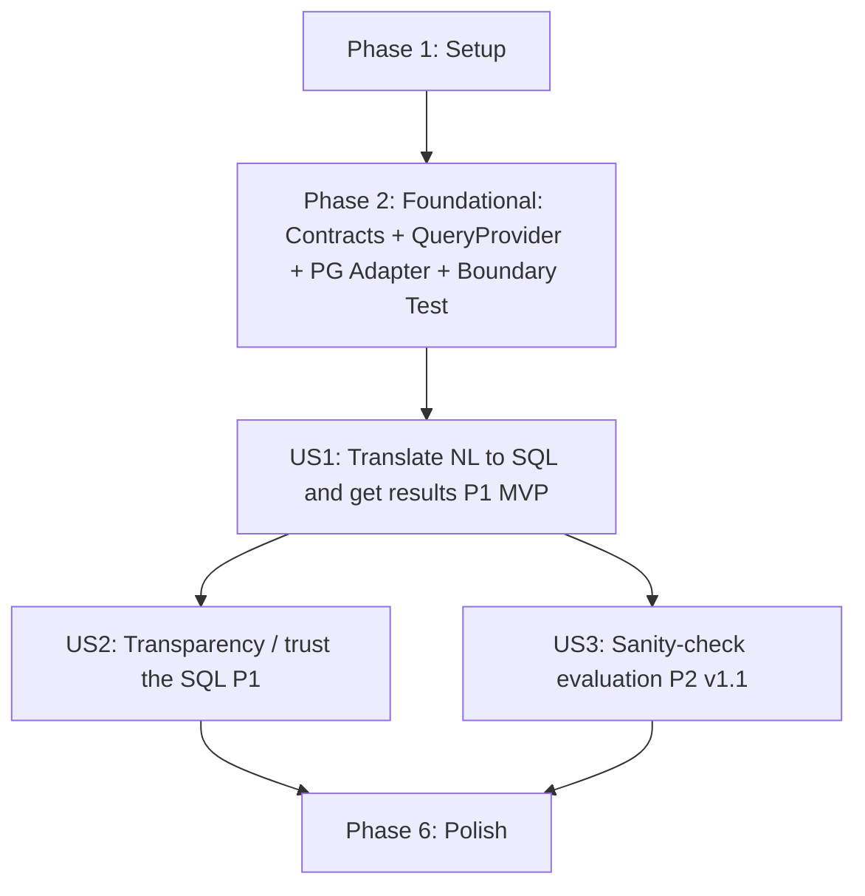

# Tasks: Text-to-SQL v1.0 / v1.1

**Input**: Design documents from `/specs/002-text-to-sql-v1/`

**Prerequisites**: plan.md (required), spec.md (required for user stories), research.md, data-model.md, contracts/

**Tests**: The constitution (v1.0.0, "Development Workflow & Quality Gates") mandates contract tests at every cross-layer/cross-domain boundary and integration tests against the Dockerized PostgreSQL. Only these constitution-required tests are included below; no separate TDD request is assumed.

**Organization**: Tasks are grouped by user story to enable independent implementation and testing of each story. Scope covers v1.0 (Text-to-SQL MVP on `Orders`) and v1.1 (lightweight logging + sanity-check evaluation). Semantic Layer / RBAC / RLS is explicitly excluded (v2.0 scope).

## Format: `[ID] [P?] [Story] Description`

- **[P]**: Can run in parallel (different files, no dependencies on incomplete tasks)
- **[Story]**: Which user story this task belongs to (US1, US2, US3)
- Include exact file paths in descriptions

## Path Conventions

Single project layout per `plan.md` § Project Structure: `src/`, `tests/`, `docker/` at repository root. New `src/ai_engineering/` domain added alongside existing `src/data_engineering/` and `src/data_access/`.

---

## Phase 1: Setup (Shared Infrastructure)

**Purpose**: Create the new AI Engineering domain package and configure environment

- [X] T001 Create `src/ai_engineering/` package structure with `__init__.py` per `plan.md` Project Structure
- [X] T002 [P] Add `FORGE_*` env vars (`FORGE_API_KEY`, `FORGE_BASE_URL`, `FORGE_MODEL_NAME`, `FORGE_MAX_TOKENS`, `FORGE_TEMPERATURE`) to `.env.example` with documented defaults per research.md Part D / FR-001 / FR-013

**Checkpoint**: AI Engineering package skeleton ready; env config documented

---

## Phase 2: Foundational (Blocking Prerequisites)

**Purpose**: Core typed contracts + `QueryProvider` Protocol extension that ALL user stories depend on

**⚠️ CRITICAL**: No user story work can begin until this phase is complete

- [X] T003 [P] Define Pydantic v2 Text-to-SQL contract models in `src/contracts/text_to_sql.py` (`LlmConfig`, `NLQuestion`, `GeneratedSql`, `ValidationResult`, `QueryRow`, `QueryResult`, `TextToSqlRequest`, `TextToSqlResponse`, `SampleQuestion`) per `data-model.md` and `contracts/text_to_sql.md`
- [X] T004 [P] Extend `QueryProvider` Protocol with `execute_readonly_query(self, sql: str, table_def: TableDef) -> list[QueryRow]` in `src/data_access/interfaces.py` per research.md Part C / FR-009
- [X] T005 Implement `execute_readonly_query` in `src/data_access/adapters/postgres/repository.py` (psycopg cursor + `dict_row` → `QueryRow.model_validate(...)`, read-only execution, typed return) per research.md Part C / FR-009 / FR-010
- [X] T006 [P] Extend boundary test in `tests/contract/test_boundaries.py` to assert no `openai` imports outside `src/ai_engineering/` (in addition to existing `pandas`/`psycopg` checks) — constitution-mandated gate per Principle II / III

**Checkpoint**: Typed contracts + `QueryProvider` extension + boundary enforcement ready; user story implementation can now begin

---

## Phase 3: User Story 1 - Translate a natural-language question into SQL and get results (Priority: P1) 🎯 MVP

**Goal**: A user asks a natural-language question about `Orders` and receives typed query results. The pipeline: NL question → semantic-context-augmented LLM → validated SQL → executed via `QueryProvider` → typed `TextToSqlResponse`.

**Independent Test**: Run `uv run python -m src.cli.main ask "What is the total sales amount?"` → confirm generated SQL is printed, result rows are returned, and the SQL is a valid SELECT against the `Orders` table.

### Implementation for User Story 1

- [X] T007 [P] [US1] Implement SQL validator in `src/ai_engineering/sql_validator.py` (keyword blacklist: INSERT/UPDATE/DELETE/DROP/TRUNCATE/ALTER/CREATE/COPY/pg_sleep; single-statement check; comment rejection `--`/`/*`; table whitelist: Orders-only; column whitelist from `TableDef`) per research.md Part A / FR-006 / FR-007 / SC-003 / SC-004
- [X] T008 [P] [US1] Implement prompt builder in `src/ai_engineering/prompt_builder.py` (`build_prompt(question: NLQuestion, dictionary: DataDictionaryDocument) -> str`; condensed column-table format ~500–800 tokens; system instruction + schema + relationships + question) per research.md Part B / FR-004
- [X] T009 [P] [US1] Implement LLM client in `src/ai_engineering/llm_client.py` (typed `LlmClient` wrapping OpenAI SDK; `LlmConfig.from_env()` classmethod; `generate_sql(prompt: str) -> GeneratedSql`; `httpx.Client(verify=False)` for Forge proxy; `openai` import confined here) per research.md Part D / FR-001 / FR-002 / FR-003
- [X] T010 [US1] Implement pipeline orchestrator in `src/ai_engineering/pipeline.py` (`TextToSqlPipeline.run(question: NLQuestion) -> TextToSqlResponse`; injects `PromptBuilder` + `LlmClient` + `SqlValidator` + `QueryProvider`; fail-fast on missing `FORGE_API_KEY` per FR-013; catches LLM/DB errors into `TextToSqlResponse.error`) per `contracts/text_to_sql.md` / FR-005 / FR-008 / FR-011
- [X] T011 [US1] Implement `ask` CLI command in `src/cli/main.py` (`uv run python -m src.cli.main ask <question>`; builds `NLQuestion`, runs `TextToSqlPipeline`, prints generated SQL + result rows; fail-fast if warehouse not running or API key missing) per FR-012 / FR-013
- [X] T012 [P] [US1] Unit tests for SQL validator in `tests/unit/test_sql_validator.py` (no LLM, no DB — pure validation logic; tests: SELECT accepted, INSERT rejected, DROP rejected, multi-statement rejected, comments rejected, non-Orders table rejected, non-existent column rejected, empty SQL rejected) per FR-006 / FR-007 / SC-003 / SC-004
- [X] T013 [P] [US1] Contract test for Text-to-SQL models in `tests/contract/test_text_to_sql.py` (assert all models in `src/contracts/text_to_sql.py` are Pydantic v2 with explicit field types; `QueryRow` accepted with dynamic data; `TextToSqlResponse` state transitions valid; `LlmConfig.from_env()` fails fast on missing key) — constitution-mandated
- [X] T014 [US1] Integration test for end-to-end pipeline in `tests/integration/test_text_to_sql.py` (skipped without Docker PG + FORGE_API_KEY) (requires Dockerized PG + `FORGE_API_KEY`; runs `ask` against a real question; asserts SQL is generated, validated, executed, and typed rows returned — no mocks) — constitution-mandated

**Checkpoint**: US1 fully functional — a user can ask a natural-language question and get typed results; MVP demonstrated

---

## Phase 4: User Story 2 - Understand and trust the generated SQL (Priority: P1)

**Goal**: The system always returns the generated SQL alongside results (or rejection reason), so users can verify what was executed. Transparency in all paths: success, validation-rejected, execution-error.

**Independent Test**: Ask a question that triggers a validation rejection (e.g., referencing `Returns`) → confirm the rejected SQL AND the rejection reason are both returned. Ask a valid question → confirm SQL appears alongside results.

### Implementation for User Story 2

- [X] T015 [P] [US2] Enhance `ask` CLI output in `src/cli/main.py` to clearly separate and display: (1) generated SQL, (2) validation status + reason, (3) result rows or execution error — in all paths (success, validation-rejected, execution-error) per FR-008 / SC-005
- [X] T016 [P] [US2] Contract test for transparency in `tests/contract/test_text_to_sql.py` (assert `TextToSqlResponse` always includes `generated_sql.sql` and `validation.sql` even when rejected; assert `validation.reason` is non-None when `accepted=False`; assert `query_result` is None when validation fails) per FR-008 / acceptance scenarios 1–3

**Checkpoint**: US2 fully functional — generated SQL is transparent in all paths; users can verify what was executed

---

## Phase 5: User Story 3 - Run a basic sanity-check over Text-to-SQL (Priority: P2 — v1.1)

**Goal**: A developer runs a simple evaluation command that passes ~10 sample questions through the pipeline and prints a pass/fail summary, catching obvious regressions without chasing precision.

**Independent Test**: Run `uv run python -m src.cli.main evaluate` → confirm a summary like `7 / 10 correct` is printed with failed question IDs listed.

### Implementation for User Story 3

- [X] T017 [P] [US3] Create sample questions file at `specs/002-text-to-sql-v1/sample_questions.json` (~10 questions covering: simple SELECT, SUM/AVG aggregation, GROUP BY, top-N with ORDER BY + LIMIT, WHERE filter, date range, COUNT, Spanish + English; each with `id`, `question`, `expected_sql_normalized`) per research.md Part E / FR-016
- [X] T018 [US3] Implement evaluation harness in `src/ai_engineering/evaluation.py` (`run_evaluation(pipeline, sample_path) -> str`; loads JSON, runs each question through `TextToSqlPipeline`, normalizes generated SQL: lowercase + whitespace-collapse, compares to `expected_sql_normalized`, prints `X / N correct` + failed IDs) per FR-017 / SC-002
- [X] T019 [US3] Implement `evaluate` CLI command in `src/cli/main.py` (`uv run python -m src.cli.main evaluate`; loads sample questions, runs evaluation, prints summary) per FR-017
- [X] T020 [P] [US3] Implement structured logging in `src/ai_engineering/pipeline.py` (log each `TextToSqlPipeline.run` call to `.artifacts/text_to_sql.log`: timestamp, input question, generated SQL, validation outcome, result/error, latency_ms) per FR-014

**Checkpoint**: US3 fully functional — a lightweight sanity-check catches regressions; each call is logged

---

## Phase 6: Polish & Cross-Cutting Concerns

**Purpose**: Final quality gates spanning all stories

- [X] T021 [P] Run `quickstart.md` end-to-end validation (checks A–G: ask English, ask Spanish, verify transparency, verify out-of-scope rejection, run unit tests, run evaluate, verify logging) per `quickstart.md` and SC-001 / SC-005 / SC-006
- [X] T022 [P] Final `mypy --strict` pass across `src/` and `tests/` (zero errors; `Any` in `QueryRow.data` and `GeneratedSql.raw_response` justified with inline comments) per constitution Principle I / Dev Workflow Quality Gates
- [X] T023 [P] Update root `README_STATUS.md` with v1.0/v1.1 milestone status, new `ai_engineering` domain, `ask`/`evaluate` CLI commands, and updated roadmap (v2.0 next) per `README_STATUS.md` maintenance routine
- [X] T024 [P] Verify governance deferral is documented: confirm `spec.md` and `plan.md` explicitly state RBAC/RLS is v2.0 scope and the system does NOT claim governance capabilities; confirm `Orders.Region` column is preserved for future RLS per constitution Principle IV / FR-020 (baseline)

---

## Dependencies

**Story completion order** (MVP first, incremental delivery):

- **Phase 2 is a hard gate**: US1, US2, US3 all depend on the Text-to-SQL contracts (T003) and the `QueryProvider` extension (T004–T005).
- **US1 → US2**: US2's transparency tests (T016) assert properties of `TextToSqlResponse` (built in T010); US2's CLI enhancement (T015) modifies the `ask` command output (built in T011).
- **US1 → US3**: US3's evaluation harness (T018) runs the pipeline (built in T010) and the logging (T020) wraps `pipeline.run`.
- **US2 and US3 are independent of each other**: US2 tests transparency; US3 adds evaluation + logging. They can be done in parallel after US1.

## Parallel Execution Examples

### Within US1 (after Phase 2 gate)
- **Parallel batch A** (different files, no inter-dependency): T007 (SQL validator) ∥ T008 (prompt builder) ∥ T009 (LLM client).
- **Sequential after A**: T010 (pipeline) depends on T007 + T008 + T009 + T005; T011 (CLI) depends on T010.
- **Parallel batch B**: T012 (validator unit tests) ∥ T013 (contract tests) — both depend only on T003/T007 being structurally present.
- **Sequential after pipeline**: T014 (integration test) depends on T010 + T011 + Dockerized PG + FORGE_API_KEY.

### Within US2 (after US1's pipeline + CLI exist)
- **Parallel batch**: T015 (CLI output enhancement) ∥ T016 (transparency contract test) — T015 modifies `cli/main.py`, T016 tests `TextToSqlResponse` (no file conflict).

### Within US3 (after US1's pipeline exists)
- **Parallel batch**: T017 (sample questions JSON) ∥ T020 (logging) — different files, no inter-dependency.
- **Sequential after**: T018 (evaluation harness) depends on T017 + T010; T019 (CLI) depends on T018.

## Implementation Strategy

**MVP first**: US1 alone delivers the first demonstrated value (a user asks a question and gets results). It is the recommended single-story MVP scope.

**Incremental delivery**: US2 amplifies US1 (transparency builds trust), and US3 adds lightweight regression detection + observability. Each story is independently testable via its Independent Test.

**Architecture adherence**: Every implementation task MUST keep `openai` imports confined to `src/ai_engineering/llm_client.py` (constitution Principle II / III), type every signature (Principle I), and route all AI Engineering → Data Access traffic through the `QueryProvider` Protocol + typed contracts in `src/contracts/text_to_sql.py` (Principle II / III). No Semantic Layer or RBAC/RLS logic is introduced (correctly deferred to v2.0 per spec).

**Excluded from this feature (explicitly)**: Semantic Layer with RBAC/RLS (v2.0), Text-to-SQL on `Returns` or `People` (v2.0), model fine-tuning, dashboard UI, multi-turn conversation, cloud deployment / BigQuery. These appear only as roadmap context in `spec.md` / `research.md`, never as tasks here.

## Done When

- [ ] `tasks.md` generated with all phases, task IDs, `[P]` markers, and exact file paths
- [ ] Extension hooks dispatched or skipped according to the rules (`.specify/extensions.yml` does not exist → skipped)
- [ ] Completion reported to user with task count, story breakdown, and MVP scope
