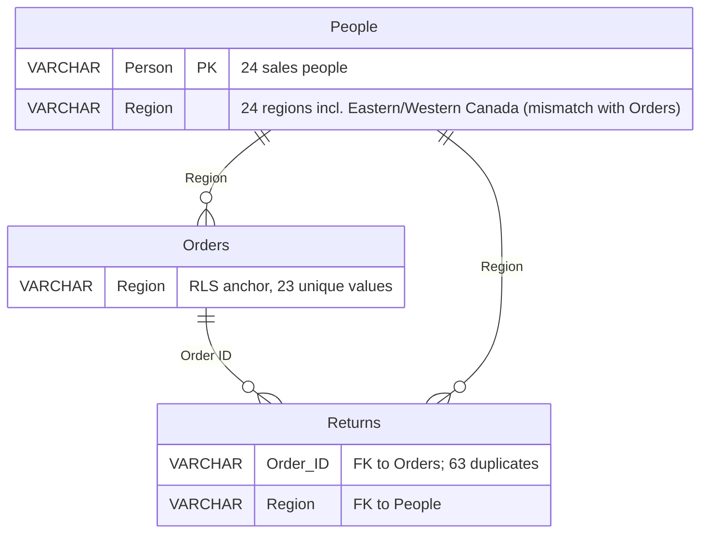

# Data Model: Semantic Layer v1

**Feature**: 003-semantic-layer-v1
**Date**: 2026-08-17
**Source**: Derived from `plan.md` Technical Context + `research.md` Parts A–F

> Este data model define los **contract models del Semantic Layer** (Pydantic v2) que viven en `src/contracts/semantic_layer.py`. NO modifica los contracts existentes (`data_access.py`, `text_to_sql.py`, `dictionary.py`) — esos siguen sin cambios. La única extensión al runtime es la composición del `GovernedQueryProvider` (que reside en `src/data_engineering/semantic_layer/`, no en `contracts/`) sobre el `QueryProvider` del CLI (ver [contracts/integration.md](./contracts/integration.md)).

## Entities (Semantic Layer Contracts)

Todos los modelos viven en `src/contracts/semantic_layer.py` (Pydantic v2, frozen, tipos explícitos). Son **engine-neutral** — ningún modelo referencia `psycopg` o SQL dialectal específico; las fórmulas SQL (`formula_sql`) usan SQL estándar y quoting doble-compatible con PostgreSQL.

### 1. `Metric`

Una métrica de negocio disponible en el Semantic Layer.

| Field | Type | Notes |
|---|---|---|
| `name` | `str` | snake_case identifier (e.g., `net_sales`, `gross_sales`, `return_rate`). MUST ser único dentro del `SemanticLayerDocument.metrics`. |
| `business_description` | `str` | Descripción en lenguaje de negocio (1-3 sentences). Aparece en el `semantic_layer.md` y en el prompt del LLM. |
| `formula_sql` | `str` | Expresión SQL válida referenciando columnas existentes de `Orders` (y opcionalmente un subquery contra `Returns`). Usa double-quote identifiers (e.g., `SUM("Sales")`). |
| `source_table` | `Literal["Orders"]` | Tabla origen. En v2.0 siempre `Orders` (joins a `Returns` se expresan dentro de `formula_sql`, no como `source_table`). |
| `aggregation` | `Literal["SUM", "AVG", "COUNT", "COUNT_DISTINCT", "RATIO", "EXPRESSION"]` | Tipo de agregación de la métrica. `RATIO` para `return_rate` (cociente de dos métricas); `EXPRESSION` para `net_profit` (fórmula proporcional). |
| `derives_from` | `list[str] \| None` | Métricas de las que depende (e.g., `net_sales` derives_from `["gross_sales", "returned_amount"]`). `None` para métricas base (`gross_sales`). |
| `uses_returns` | `bool` | `True` si la fórmula referencia `Returns` (para `returned_amount`, `net_sales`, `return_rate`, `net_profit`). Permite al builder validar que la relación Orders↔Returns esté declarada. |
| `assumption` | `str \| None` | Asunción documentada (e.g., `net_profit` asume proporcionalidad entre Sales y Profit en líneas retornadas). `None` si no hay asunción. |

**Validation rules**:
- `name` MUST ser snake_case (`^[a-z][a-z0-9_]*$`).
- Si `derives_from` is non-empty, las métricas referenciadas MUST existir en el document (validación en build-time).
- `formula_sql` MUST referenciar solo columnas que existen en el `DataDictionaryDocument` (validación en build-time contra `DictionaryEntry.name`). El builder falla rápido si la fórmula referencia una columna no existente (FR-006).
- `aggregation = "RATIO"` implica `derives_from` tiene exactamente dos entradas (numerador + denominador).

### 2. `Dimension`

Una dimensión agregable/filtrable.

| Field | Type | Notes |
|---|---|---|
| `name` | `str` | snake_case (e.g., `region`, `country`, `order_date`). |
| `column` | `str` | Columna real en `Orders` (con quoting doble, e.g., `"Region"`, `"Order Date"`). |
| `source_table` | `Literal["Orders"]` | `Orders` para todas las dimensiones en v2.0 (no `Returns` ni `People` como superficie de consulta). |
| `business_description` | `str` | Fácil de leer por un stakeholder no técnico. |
| `dimension_type` | `Literal["categorical", "temporal", "geographic"]` | Type para que el LLM y los consumers sepan cómo agrupar/parsear. |

**Validation rules**:
- `column` MUST existir en el `DataDictionaryDocument` de `Orders` (build-time check).
- `name` MUST ser único dentro del document.

### 3. `SemanticRelationship`

Una relación join entre tablas del warehouse.

| Field | Type | Notes |
|---|---|---|
| `name` | `str` | Human-readable (e.g., `"orders_to_returns"`, `"orders_to_people_by_region"`). |
| `from_table` | `Literal["Orders", "Returns", "People"]` | Tabla origen del FK. |
| `from_column` | `str` | Columna en `from_table` (quoted, e.g., `"Order ID"`, `"Region"`). |
| `to_table` | `Literal["Orders", "Returns", "People"]` | Tabla destino del FK. |
| `to_column` | `str` | Columna en `to_table` (quoted). |
| `cardinality` | `Literal["1:N", "N:1", "1:1"]` | Cardinalidad (`from` → `to`). |
| `join_type` | `Literal["LEFT", "INNER"]` | Tipo de join sugerido para combinar. `LEFT` para Orders-Returns (algunas orders no tienen returns); `INNER` para Orders-People-by-Region (todas las orders tienen una región que mapea a People). |
| `notes` | `str \| None` | Caveats (e.g., para Orders-Returns: "Returns.Order ID has duplicates — use EXISTS not direct JOIN"). |

**Validation rules**:
- `from_column` MUST existir en `DataDictionaryDocument` de `from_table`; igualmente para `to_column`.
- No debe haber relaciones duplicadas (mismo `(from_table, from_column, to_table, to_column)`).

### 4. `SemanticViewer`

El contexto de gobernanza de un usuario/viewer activo.

| Field | Type | Notes |
|---|---|---|
| `viewer_id` | `str` | Identificador del viewer (e.g., `alice`, `admin_dev`). Cargado desde `viewers.yaml`. |
| `regions` | `list[str]` | Regiones a las que el viewer tiene acceso. Vacío si `allows_full_access = False` → el resolver aplica `WHERE FALSE`. |
| `allows_full_access` | `bool` | Si `True`, el resolver NO filtra (solo efectivo cuando `ENV in {local, dev, test}`). Default `False`. |
| `is_local_dev` | `bool` | Computado en load-time (`ENV in {local, dev, test}`). Si `False` y `allows_full_access = True` → se ignora el flag (siempre se enforce RLS). Default `False`. |

**Validation rules**:
- `viewer_id` MUST ser no vacío y matchear `^[a-z][a-z0-9_]*$`.
- `regions` puede ser vacío (combinado con `allows_full_access = False`, no ve nada — escenario válido).
- Si `allows_full_access = True` e `is_local_dev = False`, el registry lo convierte a `allows_full_access = False` (defense-in-depth — no basta con el yaml para escapar governance en prod).

### 5. `SemanticLayerDocument`

El artifact top-level: el output del builder y lo que se serializa a `semantic_layer.json` / `semantic_layer.md`.

| Field | Type | Notes |
|---|---|---|
| `version` | `str` | Versión del artifact (semver, e.g., `1.0.0`). Incrementa cuando cambian las métricas definidas (no en cada regeneración, solo si el `metrics.py` cambia). |
| `tables` | `list[TableSemanticClassification]` | Clasificación de las 3 tablas: hecho/dimensión, propósito. |
| `metrics` | `list[Metric]` | Las 8 métricas definidas (FR-003). |
| `dimensions` | `list[Dimension]` | Las ~11 dimensiones (FR-004). |
| `relationships` | `list[SemanticRelationship]` | Las 2 relaciones Orders-Returns y Orders-People (FR-005). |
| `viewers` | `list[SemanticViewer]` | Viewers declarados (cargados del `viewers.yaml`, may be empty en el artifact). Vacío en el JSON canonical (los viewers son runtime config, no artifact content) — ver `serialization_notes`. |
| `source_sha256` | `str` | SHA-256 del `load_manifest.json` (link al warehouse state — provenance). |
| `semantic_source_sha256` | `str` | SHA-256 del `semantic_source.py` (link al código semántico — provenance). |
| `generated_at` | `datetime` | Timestamp UTC. **Solo se serializa al `.md`, no al `.json`** (determinismo, FR-007 / SC-005). |
| `assumptions` | `list[str]` | Asunciones del Semantic Layer (e.g., "net_profit asume proporcionalidad entre Sales y Profit en líneas retornadas"). |

**Validation rules** (en build-time, en el `builder.py`):
- `metrics` MUST contener al menos las 8 métricas de FR-003.
- `dimensions` MUST contener al menos las dimensiones mínimas (region, country, segment, category, sub_category, order_date, ship_mode, order_priority, market, customer, product).
- `relationships` MUST contener Orders-Returns (por Order ID) y Orders-People (por Region) — alineado con `data_dictionary.md` Relationships section.
- Si una métrica référencia una columna que no está en `DataDictionaryDocument`, falla en build-time (no crea un document inválido).
- Si una relación référencia tablas/columnas inexistentes, falla en build-time.

**Serialization notes** (`render.py`):
- `semantic_layer.json`: `model_dump(exclude={"generated_at", "source_file", "viewers"}, exclude_none=True)` + `json.dumps(..., sort_keys=True, indent=2, ensure_ascii=False)`. Canonical, determinista.
- `semantic_layer.md`: incluye `generated_at`, `source_sha256`, `semantic_source_sha256`, `assumptions`; relaciones y métricas con fórmulas completas; viewers omitidos (no son parte del artifact estático). Caso humano-lector.

### 6. `TableSemanticClassification`

Clasificación de cada tabla del warehouse como hecho o dimensión.

| Field | Type | Notes |
|---|---|---|
| `name` | `Literal["Orders", "Returns", "People"]` | Nombre de la tabla. |
| `table_type` | `Literal["fact", "dimension", "governance_mapping"]` | `Orders` = fact, `Returns` = fact (secundario para lógica de net sales), `People` = governance_mapping (no superficie de consulta del LLM — alimenta el mapping viewer→regions). |
| `purpose` | `str` | Heredado del `TableSemantic.purpose` en `semantic_source.py`. |

## Relationships diagram (context cross-table)

**Notas clave del dataset** (de `data_dictionary.md`):
- `Returns."Order ID"` tiene 63 duplicados sobre 2,033 filas → el JOIN para `returned_amount` usará `EXISTS (SELECT 1 FROM Returns WHERE Returns."Order ID" = Orders."Order ID")`, NO un JOIN directo (que duplicaría filas de Orders).
- `People."Region"` divide `Canada` en `Eastern Canada` + `Western Canada` (24 valores únicos) vs `Orders."Region"` que tiene solo `Canada` (23 valores). El mismatch no se resuelve en v2.0 (v3.0+). El matching es best-effort: si un viewer se scoped a `Eastern Canada`, el `IN ('Eastern Canada')` no matchea filas de `Orders.Region = 'Canada'` → 0 filas (conservador, como espera la spec).

## Canonical metrics (Fórmulas SQL cerradas)

Implementación en `src/data_engineering/semantic_layer/metrics.py` (hard-coded, no generadas dinámicamente). Las fórmulas están canonizadas en `research.md` Part F.

| Métrica | aggregation | derives_from | uses_returns | formula_sql (condensada) |
|---|---|---|---|---|
| `gross_sales` | SUM | None | False | `SUM("Sales")` |
| `returned_amount` | EXPRESSION | None | True | `SUM(CASE WHEN EXISTS (SELECT 1 FROM Returns WHERE Returns."Order ID" = Orders."Order ID") THEN "Sales" ELSE 0 END)` |
| `net_sales` | EXPRESSION | ["gross_sales", "returned_amount"] | True | `SUM(CASE WHEN NOT EXISTS (SELECT 1 FROM Returns WHERE Returns."Order ID" = Orders."Order ID") THEN "Sales" ELSE 0 END)` |
| `return_rate` | RATIO | ["returned_amount", "gross_sales"] | True | `returned_amount / NULLIF(gross_sales, 0)` (formalizado como `CASE WHEN SUM("Sales") = 0 THEN NULL ELSE returned_amount / SUM("Sales") END` en `formula_sql` completa) |
| `total_profit` | SUM | None | False | `SUM("Profit")` |
| `net_profit` | EXPRESSION | ["total_profit", "returned_amount"] | True | `SUM("Profit") - (CASE WHEN SUM("Sales") = 0 THEN 0 ELSE (returned_amount / SUM("Sales")) * SUM("Profit") END)` — asunción de proporcionalidad documentada. |
| `avg_order_value` | EXPRESSION | ["gross_sales"] | False | `SUM("Sales") / NULLIF(COUNT(DISTINCT "Order ID"), 0)` |
| `order_count` | COUNT_DISTINCT | None | False | `COUNT(DISTINCT "Order ID")` |

**Asunciones canonizadas**:
- `net_profit` asume que los returns no tienen profit propio asociado; descuenta el profit proporcionalmente a las ventas retornadas (`returned_amount / gross_sales * total_profit`). Alternativa más precisa posible en v3.0+ (subquery consultando `Orders."Profit"` de líneas retornadas).
- En todas las métricas que usan `EXISTS Returns`, el matching es por `Order ID` (no por `Row ID`) — esto descuenta todas las líneas de un orden cuando al menos una línea del Orden está en Returns. Esta es la interpretación documentada de "returned_amount" en `data_dictionary.md` (un return en `Returns` corresponde a un `Order ID`, no a un `Row ID` específico).

## Validation Rules (en build-time)

Las validaciones se enforce en `builder.py` (no en los modelos Pydantic)-> los modelos definen shape; los chequeos cross-field se hacen en el builder:

1. **Column existence**: cada `formula_sql` se parsed regex-extract para sus identifiers de columnas (tokens entre double-quotes `"..."`), y cada uno MUST existir en `DataDictionaryDocument.tables[Orders].columns[*].name` (o en `Returns`/`People` para relaciones cross-table).
2. **Metric reference closure**: cada `derives_from[*]` MUST existir en `SemanticLayerDocument.metrics[*].name`.
3. **Relationship column existence**: `from_column` MUST existir en `DictionaryEntry` de `from_table`; igualmente `to_column` para `to_table`.
4. **No duplicate metrics/dimensions/relationships by name**: falla si hay duplicados.

Si cualquiera falla, el builder lanza `ValueError` con mensaje claro (FR-006 — fail fast en build-time).

## State Definitions

Sin state machines complejos. El `SemanticLayerDocument` es frozen; se reconstruye siempre desde cero via el builder. El `SemanticViewer` se carga en runtime per-request (no persisted). El `SemanticQueryResolver.apply_rls` es pure function (no state).
