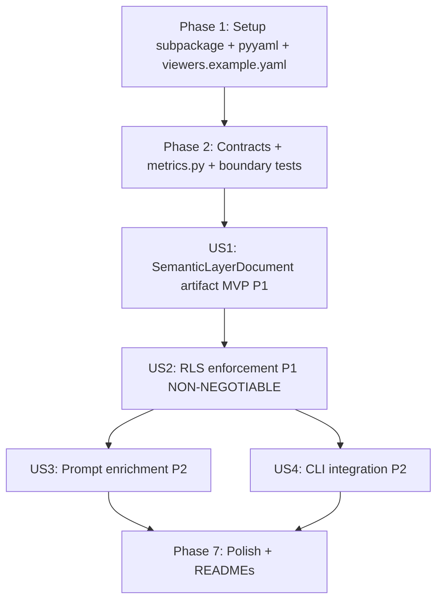

# Tasks: Semantic Layer v1 (Governed Metrics, Dimensions & RLS)

**Input**: Design documents from `/specs/003-semantic-layer-v1/`

**Prerequisites**: plan.md (required), spec.md (required for user stories), research.md, data-model.md, contracts/

**Tests**: The constitution (v1.0.0, "Development Workflow & Quality Gates") mandates contract tests at every cross-layer/cross-domain boundary and integration tests against the Dockerized PostgreSQL. These constitution-required tests are included below.

**Organization**: Tasks se agrupan por user story para habilitar implementación y testing independiente. Scope cubre US1 (artifact MVP), US2 (RLS non-negotiable), US3 (prompt enrichment), US4 (CLI), y una fase final de polish que incluye actualización de los READMEs del root del proyecto.

## Format: `[ID] [P?] [Story] Description`

- **[P]**: Can run in parallel (different files, no dependencies on incomplete tasks)
- **[Story]**: Which user story this task belongs to (US1, US2, US3, US4, READMES)
- Include exact file paths in descriptions

## Path Conventions

Single project layout per `plan.md` § Project Structure: `src/`, `tests/`, `docker/`, `.artifacts/`, at repository root. New `src/data_engineering/semantic_layer/` subpackage added alongside existing `src/data_engineering/` subpackages. New `src/contracts/semantic_layer.py` alongside existing contracts.

---

## Phase 1: Setup (Shared Infrastructure)

**Purpose**: Crear el subpaquete del Semantic Layer + nueva dependencia y archivos de config.

- [X] T001 Create `src/data_engineering/semantic_layer/` package structure with `__init__.py` per `plan.md` Project Structure
- [X] T002 [P] Add `pyyaml>=6.0` to `pyproject.toml` dependencies (and run `uv sync` to update `uv.lock`) per `research.md` Part C
- [X] T003 [P] Create `viewers.example.yaml` (committed) and add `viewers.yaml` to `.gitignore` per `research.md` Part C / FR-020
- [X] T004 [P] Add `SEMANTIC_VIEWERS_FILE` env var (optional override) and reference in `.env.example` per FR-020

**Checkpoint**: Subpaquete skeleton + `pyyaml` installed + viewer config template committed

---

## Phase 2: Foundational (Blocking Prerequisites)

**Purpose**: Contract models del Semantic Layer que TODOS los user stories dependen.

**⚠️ CRITICAL**: No user story work can begin until this phase is complete

- [X] T005 [P] Define Pydantic v2 Semantic Layer contract models in `src/contracts/semantic_layer.py` (`Metric`, `Dimension`, `SemanticRelationship`, `SemanticViewer`, `TableSemanticClassification`, `SemanticLayerDocument`, `SemanticQueryResolverProtocol`) per `data-model.md` and `contracts/semantic_layer.md` — all frozen, with validation rules
- [X] T006 [P] Define canonical metrics in `src/data_engineering/semantic_layer/metrics.py` (the 8 hard-coded metrics: `gross_sales`, `returned_amount`, `net_sales`, `return_rate`, `total_profit`, `net_profit`, `avg_order_value`, `order_count`) per `research.md` Part F / FR-003
- [X] T007 Contract test for Semantic Layer models in `tests/contract/test_semantic_layer.py` (assert all models in `src/contracts/semantic_layer.py` are Pydantic v2 frozen with explicit field types; `SemanticLayerDocument` with 8 metrics + 11+ dimensions + 2 relationships satisfies validation; resolver implements `SemanticQueryResolverProtocol`) — constitution-mandated
- [X] T008 Extend boundary test in `tests/contract/test_boundaries.py` to assert: (a) `pyyaml` imports only in `data_engineering/semantic_layer/registry.py`; (b) `openai`/`httpx` still confined to `ai_engineering/`; (c) `psycopg` still confined to `data_access/adapters/postgres/`; (d) AST/grep check: no caller of `execute_readonly_query` in `src/ai_engineering/` invokes the adapter directly (must go through `QueryProvider` Protocol) per `research.md` Part E / constitution Principle IV

**Checkpoint**: Typed contracts + metrics canonizadas + boundary enforcement extended; user story implementation can now begin

---

## Phase 3: User Story 1 — Materializar la capa semántica como artifact declarativo (Priority: P1) 🎯 MVP

**Goal**: Un contributor ejecuta `generate-semantic-layer` y se producen `semantic_layer.md` + `semantic_layer.json` con las métricas, dimensiones y relaciones derivadas de las fuentes existentes.

**Independent Test**: `uv run python -m src.cli.main generate-semantic-layer` → se escriben los dos artefactos y se imprime un resumen (tablas, métricas, dimensiones, relaciones).

### Implementation for User Story 1

- [X] T009 [P] [US1] Implement `SemanticLayerBuilder.build(dictionary, semantic_source_sha256, source_sha256) -> SemanticLayerDocument` in `src/data_engineering/semantic_layer/builder.py` (builds from `metrics.py` + `DataDictionaryDocument`; validates column existence and metric closure per `data-model.md` § Validation Rules / FR-006; fail-fast on invalid references) per `contracts/semantic_layer.md` · FR-001 · FR-006
- [X] T010 [P] [US1] Implement `ViewerRegistry.load_viewers(path) -> list[SemanticViewer]` and `.get_viewer(viewer_id) -> SemanticViewer` in `src/data_engineering/semantic_layer/registry.py` (parses `viewers.yaml` via `pyyaml`; computes `is_local_dev`; forces `allows_full_access=False` if not local/dev/test; raises on unknown viewer listing available IDs) per FR-020 / `contracts/semantic_layer.md`
- [X] T011 [P] [US1] Implement `SemanticLayerRenderer.render_json(document) -> str` and `.render_markdown(document) -> str` in `src/data_engineering/semantic_layer/render.py` (canonical JSON via `exclude={"generated_at","viewers"}` + `sort_keys=True`; markdown con generated_at + hashes + asunciones) per FR-007 / SC-005 / `data-model.md` § Serialization notes
- [X] T012 [US1] Add `generate-semantic-layer` CLI command in `src/cli/main.py` (loads `DataDictionaryDocument` from `.artifacts/load_manifest.json` hash or regenerates via existing dictionary generator; calls builder; writes `.artifacts/semantic_layer.json` + `.artifacts/semantic_layer.md`; prints summary: tables, metrics count, dimensions count, relationships) per FR-018 / SC-001
- [X] T013 [P] [US1] Unit test for builder invariants in `tests/unit/test_semantic_builder.py` (loads real `semantic_source.py`; builds against a fixture `DataDictionaryDocument`; asserts: 8 metrics present, 2 relationships, falsy if column referenced in `formula_sql` doesn't exist in dictionary — fail-fast) per FR-006 / `data-model.md` § Validation Rules
- [X] T014 [P] [US1] Contract test for determinism in `tests/contract/test_semantic_layer.py` (extend T007 — adds: build twice, sha256 of `render_json` output must match) per FR-007 / SC-005

**Checkpoint**: US1 fully functional — `generate-semantic-layer` produces deterministic JSON + readable MD; artifact is the single source of truth for business semantics

---

## Phase 4: User Story 2 — Enforzar RLS: ningún SQL del LLM bypassa governance (Priority: P1, NON-NEGOTIABLE)

**Goal**: La garantía constitucional NON-NEGOTIABLE (Principle IV) se satisface: cualquier SQL que pase por el `QueryProvider` está filtrado por `Region` según el viewer activo.

**Independent Test**: Dos viewers con regiones distintas hacen `ask` sobre el mismo total; resultados difieren y coinciden con `SELECT SUM(Sales) WHERE Region IN (...)` directo sobre PG.

### Implementation for User Story 2

- [X] T015 [P] [US2] Implement `SemanticQueryResolver.apply_rls(sql, viewer, table_def) -> str` in `src/data_engineering/semantic_layer/resolver.py` (pure function; subquery wrapping per research.md Part A; handles: viewer with regions, viewer.regions=[], viewer.allows_full_access; logs `gov.bypass` when bypassing) per FR-010 / FR-011 / FR-013 / FR-014 / `contracts/semantic_layer.md`
- [X] T016 [P] [US2] Implement `GovernedQueryProvider` decorator in `src/data_engineering/semantic_layer/governed_provider.py` (implements `QueryProvider` Protocol; injects `SemanticQueryResolverProtocol` + `SemanticViewer` + `TableDef`; calls `apply_rls` before delegating `execute_readonly_query` to the wrapped `QueryProvider`) per `contracts/integration.md` / FR-012
- [X] T017 [P] [US2] Implement `_UngovernedFailFastProvider` safety net in `src/data_engineering/semantic_layer/governed_provider.py` (raises `ValueError` on any `execute_readonly_query` call; returned by CLI composition root when no viewer is provided) per FR-019 / `contracts/integration.md`
- [X] T018 [P] [US2] Unit tests for `apply_rls` in `tests/unit/test_semantic_resolver.py` (covers: single region, multiple regions, empty regions → `WHERE FALSE`, `allows_full_access=True` with `is_local_dev=True` → unchanged + logged; SQL with WHERE, without WHERE, with GROUP BY, with JOIN to Returns, with LIMIT; quoting; SQL injection attempt on `regions` is escaped) per FR-010 / FR-011 / FR-013 / FR-014 / SC-003
- [X] T019 [P] [US2] Contract test for `GovernedQueryProvider` in `tests/contract/test_semantic_layer.py` (extend T007 — asserts: implements `QueryProvider` Protocol; calls resolver exactly once per `execute_readonly_query`; viewer with empty regions delegates to underlying provider with `WHERE FALSE` SQL; `allows_full_access` path logs `gov.bypass`) per FR-012
- [X] T020 [US2] Integration test for RLS end-to-end in `tests/integration/test_semantic_rls.py` (skipped without Docker PG + `viewers.yaml`) — requires Dockerized PG + `FORGE_API_KEY` + `viewers.yaml` defining two viewers `alice` (Caribbean + Central America) and `bob` (Central US); runs `ask --viewer alice "total sales"` and `ask --viewer bob "total sales"`; asserts: (a) Alice's total equals `SELECT SUM(Sales) WHERE Region IN ('Caribbean','Central America')` direct query against PG; (b) Bob's total equals his region filter; (c) Totals differ (no bypass)) per SC-002 / SC-008 / constitution Principle IV

**Checkpoint**: US2 fully functional — governance enforced by design; any bypass is catched by integration test

---

## Phase 5: User Story 3 — Enriquecer el prompt de Text-to-SQL con capa semántica (Priority: P2)

**Goal**: El `PromptBuilder` acepta opcionalmente un `SemanticLayerDocument` y añade un bloque condensado de métricas + dimensiones + joins (~+400 tokens).

**Independent Test**: `ask --viewer alice "Show me net sales by region"` (with semantic layer) genera SQL que hace JOIN con Returns; no es igual a "gross sales by region".

### Implementation for User Story 3

- [X] T021 [P] [US3] Extend `build_prompt` in `src/ai_engineering/prompt_builder.py` with optional `semantic_layer: SemanticLayerDocument | None = None` parameter (when present, inserts block between Relationships and Rules with: metrics list ~one line per metric incl. `formula_sql` condensed, dimensions grouped by `dimension_type`, joins block referencing Returns by Order ID with caveat about duplicates) per `research.md` Part B / FR-015 / FR-016 / FR-017
- [X] T022 [US3] Extend `TextToSqlPipeline` constructor in `src/ai_engineering/pipeline.py` to accept optional `semantic_layer: SemanticLayerDocument | None = None` and pass it to `build_prompt`; ensure fallback (semantic_layer=None) is byte-identical to behavior of feature 002 (FR-016) per FR-016
- [X] T023 [P] [US3] Adjust `SqlValidator` in `src/ai_engineering/sql_validator.py` to ACCEPT `Returns` as a valid JOIN target (table whitelist: `Orders` + `Returns`); keep rejecting `People` references; Returns column whitelist added (validates Returns columns when referenced) per `contracts/integration.md` § SqlValidator minimal adjustment
- [X] T024 [P] [US3] Extend `tests/unit/test_sql_validator.py` with cases: SQL `FROM Orders JOIN Returns ...` accepted; SQL `FROM Orders JOIN People ...` rejected with clear message; SQL with non-existent Returns column rejected
- [X] T025 [P] [US3] Unit test for `build_prompt` with semantic layer in `tests/contract/test_text_to_sql.py` (extend existing — asserts: prompt includes metric names + business descriptions + join notes; prompt size ~+400 tokens over 002 baseline; fallback `semantic_layer=None` produces identical prompt to 002)

**Checkpoint**: US3 fully functional — Text-to-SQL distinguishes net vs gross; fallback to 002 behavior preserved

---

## Phase 6: User Story 4 — Operar la Semantic Layer por CLI (Priority: P2)

**Goal**: Un contributor ejecuta `generate-semantic-layer` y `ask --viewer alice "<question>"` desde la CLI; el composition root en `cli/main.py` wire todo junto (GovernedQueryProvider + viewer + resolver + semantic layer).

**Independent Test**: `generate-semantic-layer` then `ask --viewer alice "total sales"`; verify artifact generated and results scoped by Alice's regions.

### Implementation for User Story 4

- [X] T026 [US4] Extend `ask` CLI command in `src/cli/main.py` with `--viewer <id>` (required for any `ask` invocation; loads viewer via `ViewerRegistry`); and `--allow-full-access` flag for local/dev only per FR-019 / FR-013
- [X] T027 [US4] Composition root in `src/cli/main.py` — `build_query_provider(viewer, table_def)` returns: (1) `_UngovernedFailFastProvider` if viewer is None; (2) `GovernedQueryProvider(delegate=PostgresRepository, resolver=SemanticQueryResolver, viewer=viewer, table_def=table_def)` if viewer is not None. The returned object is wired into `TextToSqlPipeline` constructor per `contracts/integration.md` § Composition root / FR-012
- [X] T028 [US4] Extend logging in `src/ai_engineering/pipeline.py` `_log_call` to include `viewer_id`, `regions`, `gov_bypass` in the `.artifacts/text_to_sql.log` line (extending 002's format) per FR-021
- [X] T029 [P] [US4] Extend `tests/integration/test_text_to_sql.py` (existing) with a scenario that runs `ask --viewer alice "total sales"` against Dockerized PG + Forge; asserts: (a) SQL executed includes `WHERE "Region" IN ('Caribbean', 'Central America')`; (b) result count is non-zero; (c) log line includes `viewer_id=alice` and `gov_bypass=False`
- [X] T030 [US4] Fallback test in `tests/unit/test_cli_ask.py` (NEW) — without Docker PG: invoking `ask` without `--viewer` raises a clear `ValueError` (would-be `_UngovernedFailFastProvider`); invoking with `--viewer unknown_id` raises with list of available IDs

**Checkpoint**: US4 fully functional — end-to-end CLI workflow reproducible; fail-fast on missing or unknown viewer

---

## Phase 7: Polish & Documentation Updates (Cross-Cutting)

**Purpose**: Cerrar calidad transversal y actualizar los READMEs del root del proyecto para reflejar v2.0 y Semantic Layer.

- [X] T031 [P] Run `quickstart.md` end-to-end validation (checks A1–E2 per `quickstart.md`: generate-semantic-layer, ask fails without viewer, ask with two viewers + diff, semantic-layer net vs gross, contract tests, unit tests, integration tests, mypy, logging extension) per `quickstart.md` / SC-001 / SC-002 / SC-005 / SC-006 / SC-007 / SC-008
- [X] T032 [P] Final `mypy --strict` pass across `src/` and `tests/` (zero errors; new `Any` requires inline justification per constitution Principle I; `SemanticViewer` region strings justified at load boundaries) per constitution Principle I / SC-007
- [X] T033 [P] [READMES] Update `README.md` (root) — bump status to v2.0 Semantic Layer + Governance; add a "Semantic Layer (v2.0)" section describing what the layer delivers (metrics/dimensions/RLS); add `generate-semantic-layer` and `ask --viewer <id>` to Quickstart commands; add `viewers.yaml` to Prereqs; refresh Architecture diagram to mention `src/data_engineering/semantic_layer/`; refresh Roadmap (next milestone → v3.0 if applicable) per user request / `README_STATUS.md` maintenance routine
- [X] T034 [P] [READMES] Update `README_STATUS.md` (root) — set the "Estado actual (snapshot)" date and branch to `003-semantic-layer-v1` / `v2.0`; mark Milestone **M3 as Completado**; add v2.0 delivery summary to "Cobertura implementada vs roadmap"; refresh "Riesgos y puntos de atención" (mark Governance risk as Resolved; add new risk about `People.Region` mismatch deferred to v3.0); refresh Backlog table (M3 → Completado, add M4 → v3.0 next); add a closing-iteration entry in the "Rutina de mantenimiento" format per user request / `README_STATUS.md` routine
- [X] T035 [P] [READMES] Update `README_SPECKIT.md` (root) — add feature `003-semantic-layer-v1` to "Resumen de lo que ya hicimos con Spec Kit" numbered list (now 3 features); add a new item to "Arquitectura alineada" mentioning `src/data_engineering/semantic_layer/` and `src/contracts/semantic_layer.py`; add `viewers.yaml` pattern + `pyyaml` dependency note to "Convenciones acordadas en esta baseline"; refresh "Errores comunes" with any new gotcha discovered during implementation (e.g., `_gov` alias reserved, `People.Region` mismatch behavior) per `README_SPECKIT.md` structure
- [X] T036 [P] Verify governance deferral is now resolved: confirm `spec.md`, `plan.md`, and root READMEs explicitly state RLS is enforced (no longer v2.0-deferred — it is delivered); confirm `Orders.Region` enforcement is active in `GovernedQueryProvider` per constitution Principle IV / SC-002 / SC-003

## Dependencies

**Story completion order** (MVP first, then governance, then enrichment, then CLI):

- **Phase 2 is a hard gate**: US1 depends on contract models (T005) and metrics (T006); US2 depends on contract models + contract test assertions (T008).
- **US1 → US2**: US2's `GovernedQueryProvider` (T016) wraps a `QueryProvider` and uses the `SemanticViewer` defined in T005; US2's resolver (T015) operates on `SemanticViewer`.
- **US2 → US3**: US3's `Pipeline` extension (T022) coexists with US2's `GovernedQueryProvider` injection (T027 in US4). They are independent files (pipeline.py vs cli/main.py) but the integration test T029 needs both.
- **US1 → US3**: US3's prompt enrichment (T021) takes a `SemanticLayerDocument` (built in T009, US1) as input.
- **US3 and US4** are mostly independent; US4's composition root (T027) wires together the semantic layer + viewer + resolver + governed provider, so it depends on US1 (artifact), US2 (resolver + governed_provider), and US3 (semantic_layer parameter in pipeline).
- **Phase 7 Polish + READMEs** depends on all user stories being complete; cannot update root READMEs until v2.0 scope is confirmed delivered.

## Parallel Execution Examples

### Within US1 (after Phase 2 gate)
- **Parallel batch A**: T009 (builder) ∥ T010 (registry) ∥ T011 (renderer) — different files, no inter-dependency.
- **Sequential after A**: T012 (CLI command) depends on T009 + T011.
- **Parallel batch B**: T013 (builder unit tests) ∥ T014 (determinism contract test) — both depend on T009; no file conflict.

### Within US2 (after Phase 2 gate)
- **Parallel batch C**: T015 (resolver) ∥ T016 (governed_provider) ∥ T017 (fail-fast provider) — resolver is pure; governed_provider depends on resolver + contracts; fail-fast provider is standalone. T015 and T017 are well-isolated.
- **Parallel batch D**: T018 (resolver unit tests) ∥ T019 (governed_provider contract test) — T018 depends on T015; T019 depends on T016. Different files.
- **Sequential after**: T020 (integration test) depends on T015 + T016 + T017 + Dockerized PG + Forge + viewers.yaml.

### Within US3 (after US2's resolver exists — though US3 mostly depends on US1's artifact)
- **Parallel batch E**: T021 (prompt builder extension) ∥ T023 (SqlValidator adjustment) ∥ T024 (validator tests) — different files.
- **Sequential after E**: T022 (pipeline extension) depends on T021; T025 (prompt test) depends on T022.

### Within US4 (after US2's GovernedQueryProvider + US3's prompt enrichment)
- **Sequential**: T026 (ask --viewer) → T027 (composition root) → T028 (logging extension) → T029 (integration test) → T030 (cli unit test).
- The composition root T027 wires everything together; cannot run until US1 + US2 + US3 deliverables exist.

### Within Phase 7 (Polish + READMEs)
- **Parallel batch F**: T033 (README.md) ∥ T034 (README_STATUS.md) ∥ T035 (README_SPECKIT.md) — three independent root README files.
- **Sequential**: T031 (quickstart e2e) → T032 (mypy strict) → T036 (verify governance delivered). These are validation/closure tasks.

## Implementation Strategy

**MVP first**: US1 alone delivers independent value — the artifact `semantic_layer.md` + `.json` is the single source of truth for business semantics, usable even before the pipeline integration. It is the recommended single-story MVP scope.

**NON-NEGOTIABLE next**: US2 is constitutionally required (Principle IV). Cannot ship v2.0 without US2 + US4 working together — a `SemanticLayerDocument` without RLS enforcement would still be a system *without* governance.

**Quality amplifiers**: US3 (prompt enrichment) and US4 (CLI composition) build on US1 + US2 and complete the end-to-end story.

**Architecture adherence**: Every implementation task MUST keep `pyyaml` confined to `data_engineering/semantic_layer/registry.py` (constitution Principle I/III), keep `openai`/`httpx` confined to `ai_engineering/llm_client.py` (carried from 002), keep `psycopg` confined to `data_access/adapters/postgres/repository.py` (carried from 001), type every signature (Principle I), route Semantic Layer traffic through `src/contracts/semantic_layer.py` (Principle II), and ensure the `GovernedQueryProvider` wraps every `QueryProvider` at the composition root in `cli/main.py` (Principle IV — NON-NEGOTIABLE).

**Excluded from this feature**: RBAC column-level enforcement (v3.0+); auth real OIDC/JWT (out of scope); audit logging system completo (out of scope); People.Region taxonomy resolution (v3.0+); BigQuery migration (future); dashboard UI; multi-turn conversation; model fine-tuning. These appear only as roadmap context in `spec.md` / `research.md`, never as tasks here.

## Done When

- [ ] `tasks.md` generated with all phases, task IDs, `[P]` markers, exact file paths, and user-story grouping
- [ ] Phases 1–7 cover setup, foundational, US1 (MVP), US2 (RLS), US3 (prompt), US4 (CLI), and polish + READMEs
- [ ] README-update tasks (T033, T034, T035) explicitly included per user request
- [ ] Constitution Principle IV (RLS) satisfied and tested end-to-end
- [ ] Extension hooks: `.specify/extensions.yml` does not exist → skipped (no mandatory or optional post-plan hooks)
- [ ] Completion reported to user with task count, story breakdown, MVP scope, and README-update tasks
