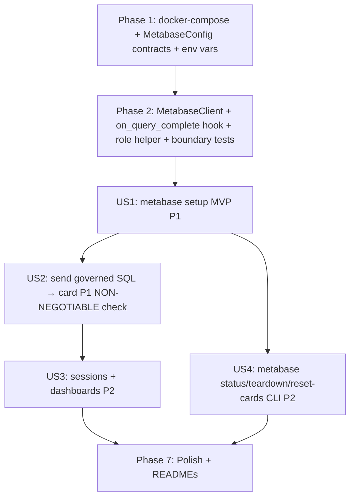

# Tasks: Metabase Integration (Governed SQL Cards from Chat Sessions)

**Input**: Design documents from `/specs/004-metabase-integration/`

**Prerequisites**: plan.md (required), spec.md (required for user stories), research.md, data-model.md, contracts/

**Tests**: The constitution (v1.0.0, "Development Workflow & Quality Gates") mandates contract tests at every cross-layer/cross-domain boundary and integration tests against the Dockerized PostgreSQL. These constitution-required tests are included below; the Metabase-specific tests extend this with HTTP-level unit tests (fake transport) and end-to-end integration tests (require Docker Metabase + Forge).

**Organization**: Tasks se agrupan por user story para habilitar implementación y testing independiente. Scope cubre US1 (Metabase up + connected MVP), US2 (envío automático de SQL gobernado desde `ask` → card), US3 (sessions agrupando varias cards en un dashboard), US4 (CLI operations), y una fase final de polish que incluye actualización de los READMEs del root y validación de governance NON-NEGOTIABLE (SC-003).

## Format: `[ID] [P?] [Story] Description`

- **[P]**: Can run in parallel (different files, no dependencies on incomplete tasks)
- **[Story]**: Which user story this task belongs to (US1, US2, US3, US4, READMES)
- Include exact file paths in descriptions

## Path Conventions

Single project layout per `plan.md` § Project Structure: `src/`, `tests/`, `docker/`, `.artifacts/`, at repository root. New `src/ai_engineering/metabase_client.py` module added alongside existing `src/ai_engineering/`. New `src/contracts/metabase.py` alongside existing contracts. New `src/data_access/adapters/postgres/roles.py` helper confined to the PG adapter package.

---

## Phase 1: Setup (Shared Infrastructure)

**Purpose**: Introducir el servicio de Metabase en Docker, el contract de configuración, y el boundary del cliente HTTP.

- [X] T001 [P] Add the `metabase` service to `docker/docker-compose.yml` (image `metabase/metabase:v0.48-latest`, port `3000`, volume `plataforma_metabase_data`, healthcheck `GET /api/health`, depends_on postgres healthy) per `plan.md` Project Structure / `research.md` Part B
- [X] T002 [P] Add `METABASE_*` env vars (`METABASE_HOST`, `METABASE_PORT`, `METABASE_ADMIN_EMAIL`, `METABASE_ADMIN_PASSWORD`) to `.env.example` with documented defaults per FR-002 / FR-008
- [X] T003 [P] Define Pydantic v2 Metabase contract models in `src/contracts/metabase.py` (`MetabaseConfig` with `from_env()` classmethod, `Card`, `Collection`, `Dashboard`, `DashboardItem`, `MetabaseSession`) per `data-model.md` — all frozen, with validation rules
- [X] T004 [P] Add `.artifacts/metabase_state.json` to `.gitignore` (local state cache; regeneratable via `metabase setup`) per `research.md` Part F

**Checkpoint**: Docker Metabase service defined; contracts tipos; env vars documented; state file gitignored.

---

## Phase 2: Foundational (Blocking Prerequisites)

**Purpose**: `MetabaseClient` HTTP boundary + `on_query_complete` callback en `TextToSqlPipeline` que TODOS los user stories dependen.

**⚠️ CRITICAL**: No user story work can begin until this phase is complete

- [X] T005 [P] Implement `MetabaseClient` in `src/ai_engineering/metabase_client.py` (the ONLY module that imports `httpx`; `login() -> str` session token, `_ensure_session()`, `_reauth_on_401()` helper; methods: `is_setup_complete`, `setup_initial`, `create_db_connection`, `get_or_create_collection`, `create_card`, `get_or_create_dashboard`, `add_card_to_dashboard`, `send_governed_query`, `list_cards_in_collection`, `delete_card`, `get_health`, `get_version`) per `contracts/metabase_client.md` · FR-006 · FR-007 · FR-008 · FR-009
- [X] T006 [P] Implement `ensure_metabase_readonly_role(repo, password)` in `src/data_access/adapters/postgres/roles.py` (idempotente: CREATE ROLE IF NOT EXISTS + GRANT SELECT ON ALL TABLES + ALTER DEFAULT PRIVILEGES; engine-specific code confined to PG adapter per constitution Principle III) per `research.md` Part C / FR-025
- [X] T007 Extend `TextToSqlPipeline` in `src/ai_engineering/pipeline.py` to accept optional `on_query_complete: Callable[[TextToSqlResponse, SemanticViewer | None], None] | None = None` parameter; invoke the callback at the end of a successful `run(question)` inside a try/except (best-effort, FR-013 — pipeline never breaks if the callback fails) per `contracts/pipeline_integration.md` / FR-010
- [X] T008 Extend boundary test in `tests/contract/test_boundaries.py` to assert: (a) `httpx` imports stay within `src/ai_engineering/` (both `llm_client.py` from 002 and the new `metabase_client.py`); (b) `metabase_client.py` does NOT import `psycopg`, `openai`, or `pyyaml`; (c) `pipeline.py` does NOT import `metabase_client` (the callback is generic, no direct coupling) per `research.md` Part A / constitution Principle II/III
- [X] T009 [P] Contract test for Metabase models in `tests/contract/test_metabase.py` (assert all models in `src/contracts/metabase.py` are Pydantic v2 frozen with explicit field types; `MetabaseConfig.from_env()` fails fast on missing `METABASE_ADMIN_EMAIL`/`METABASE_ADMIN_PASSWORD`; `Card.sql` must be non-empty; `Card.display` Literal closed set) — constitution-mandated
- [X] T010 [P] Unit tests for `MetabaseClient` in `tests/unit/test_metabase_client.py` using `httpx.MockTransport` (no Docker Metabase required): login + token caching, re-auth on 401, `is_setup_complete` true/false branches, `create_card` payload shape, `get_or_create_collection` idempotency, `send_governed_query` best-effort (never raises; logs warning on HTTP error) per FR-013

**Checkpoint**: HTTP boundary + injection point + role helper ready; user story implementation can begin.

---

## Phase 3: User Story 1 — Levantar Metabase y conectarse al warehouse (Priority: P1) 🎯 MVP

**Goal**: Un contributor ejecuta `metabase setup` desde clean clone y queda Metabase corriendo, admin user creado, DB connection a PostgreSQL configurada (read-only role), y colección "Chat Sessions" creada. Reproducible e idempotente.

**Independent Test**: `uv run python -m src.cli.main metabase setup` → `http://localhost:3000` login con creds de `.env` → PostgreSQL listed as database → "Chat Sessions" collection exists.

### Implementation for User Story 1

- [X] T011 [US1] Implement `cmd_metabase_setup` in `src/cli/main.py` (trae arriba el container de Metabase via docker compose if not running; wait healthcheck; ensure `metabase_readonly` PG role via T006 helper; instantiate MetabaseClient; check `is_setup_complete()` — if false, `setup_initial()`; `create_db_connection()`; `get_or_create_collection("Chat Sessions")`; persist `.artifacts/metabase_state.json`; print summary) per FR-003 · FR-004 · FR-005 · SC-001
- [X] T012 [P] [US1] Implement `_wait_for_metabase_health(client, timeout_s=120)` helper in `src/cli/main.py` (polls `GET /api/health` until 200 OK or timeout; fails fast with clear error FR-013 if Metabase never comes up) per FR-005 / SC-001
- [X] T013 [P] [US1] Implement `_save_metabase_state(state, path)` and `_load_metabase_state(path)` helpers in `src/cli/main.py` (read/write `.artifacts/metabase_state.json` as `MetabaseSession` Pydantic v2) per `research.md` Part F / FR-004
- [X] T014 [P] [US1] Integration test for setup idempotency in `tests/integration/test_metabase_setup.py` (skipped without Docker Metabase): run `metabase setup` twice; assert second run detects setup is complete and doesn't re-create admin user (check `GET /api/user` count == 1) per FR-004

**Checkpoint**: US1 fully functional — `metabase setup` from clean clone reaches a working, configured Metabase with PostgreSQL connected and "Chat Sessions" collection. MVP demonstrated.

---

## Phase 4: User Story 2 — Enviar queries gobernadas a Metabase desde `ask` (Priority: P1)

**Goal**: Un `ask --viewer <persona>` exitoso automáticamente crea una card en Metabase con el SQL **ya gobernado** (post-`GovernedQueryProvider`). La governance NON-NEGOTIABLE (Principle IV) se preserva: re-ejecutar la card desde Metabase devuelve solo los datos del viewer scope.

**Independent Test**: `ENV=local ask --viewer marilene_rousseau "total sales by region"` (con Metabase configurada) → abrir Metabase → ver una card nueva con SQL que incluye `WHERE "Region" IN ('Caribbean')` → re-ejecutar la card desde la UI y confirmar que solo aparecen filas de Caribbean (SC-003 NON-NEGOTIABLE check).

### Implementation for User Story 2

- [X] T015 [US2] Implement `_infer_display_type(response)` helper in `src/ai_engineering/metabase_client.py` (heurística: scalar si 1 row × 1 col; bar si GROUP BY present y ≤20 rows; table default) per `research.md` Part E / FR-012
- [X] T016 [US2] Implement `MetabaseClient.send_governed_query(response, viewer, session_id)` in `src/ai_engineering/metabase_client.py` (high-level helper: infiere display, construye `Card.name` desde `question.text` truncated a 140 chars, setea `Card.description` con `viewer_id` + `gov_bypass` flag + timestamp, calls `create_card`; if `session_id` non-None, get_or_create_dashboard + add_card_to_dashboard; returns `Card | None`) per `contracts/metabase_client.md` · FR-012 / FR-013 / FR-015
- [X] T017 [US2] Implement `build_metabase_callback(client, session_id)` composition helper in `src/cli/main.py` (returns a closure `Callable[[TextToSqlResponse, SemanticViewer | None], None]` that calls `client.send_governed_query`; if `client is None`, returns None) per `contracts/pipeline_integration.md` § Composition root / FR-010
- [X] T018 [US2] Extend `cmd_ask` in `src/cli/main.py` to: (a) instantiate `MetabaseClient` only if Metabase is enabled (`METABASE_HOST` set and `--no-metabase` not passed and Metabase is reachable — best-effort probe); (b) wire `build_metabase_callback(client, session_id)` into `TextToSqlPipeline(..., on_query_complete=callback)` if `--no-metabase` not set; pass `None` otherwise per FR-010 / FR-014
- [X] T019 [US2] Extend `ask` arg parser in `src/cli/main.py` `main()` to accept `--no-metabase` flag (sets `metabase_enabled=False`) — when set, never instantiates `MetabaseClient`, skips the callback wiring per FR-014 / SC-006
- [X] T020 [US2] Extend logging in `src/ai_engineering/pipeline.py` `_log_call` to include `metabase_card_id` and `metabase_status` fields in `.artifacts/text_to_sql.log` (status: `created` / `skipped` / `failed`) per FR-021 (already extended for viewers in 003; add metabase fields)
- [X] T021 [P] [US2] Unit test for `_infer_display_type` in `tests/unit/test_metabase_client.py` (scalar for single-row single-col, bar for GROUP BY ≤20 rows, table for default, table for >20 rows even with GROUP BY)
- [X] T022 [P] [US2] Unit test for `send_governed_query` best-effort in `tests/unit/test_metabase_client.py` (returns Card on success; returns None on HTTP error and logs warning WITHOUT raising; never propagates exceptions to caller) per FR-013 / SC-007
- [X] T023 [US2] Integration test for governance NON-NEGOTIABLE in `tests/integration/test_metabase_integration.py` (skipped without Docker Metabase + Forge + viewers.yaml): runs `ask --viewer marilene_rousseau "total sales by region"` → list Metabase cards in "Chat Sessions" → find the card with `WHERE "Region" IN ('Caribbean')` in its SQL → re-execute via `POST /api/dataset` → assert all returned rows have `"Region" = 'Caribbean'` (NO data leakage from other regions) per SC-003 NON-NEGOTIABLE / constitution Principle IV

**Checkpoint**: US2 fully functional — every successful `ask` creates a Metabase card with governed SQL; re-executing from Metabase returns scoped data.

---

## Phase 5: User Story 3 — Sesiones agrupadas en dashboards (Priority: P2)

**Goal**: Un usuario puede pasar `--session <id>` para agrupar todas las cards de esa sesión en un dashboard "Session: <id>" en Metabase, viendo todo el conversation flow en una vista.

**Independent Test**: Correr 3 `ask --session my-bi-review` con preguntas distintas → abrir Metabase → ver un dashboard "Session: my-bi-review" con las 3 cards en secuencia.

### Implementation for User Story 3

- [X] T024 [P] [US3] Implement `MetabaseClient.get_or_create_dashboard(name, collection_id)` in `src/ai_engineering/metabase_client.py` (search `GET /api/dashboard` by name + collection; if none, `POST /api/dashboard`; return `Dashboard`) per `contracts/metabase_client.md`
- [X] T025 [P] [US3] Implement `MetabaseClient.add_card_to_dashboard(card_id, dashboard_id)` in `src/ai_engineering/metabase_client.py` (`POST /api/dashboard/{id}/dashcard` with `{card_id}`; Metabase handles auto-position) per `contracts/metabase_client.md`
- [X] T026 [US3] Extend `cmd_ask` in `src/cli/main.py` to accept `--session <id>` flag (parsed in `main()` args; passed through to `build_metabase_callback(client, session_id)`); when set, `send_governed_query` creates or finds the session dashboard and adds the card per FR-015 / FR-016
- [X] T027 [P] [US3] Unit test for `get_or_create_dashboard` idempotency in `tests/unit/test_metabase_client.py` (first call creates; second call finds existing; both return same dashboard id)
- [X] T028 [P] [US3] Integration test for session grouping in `tests/integration/test_metabase_integration.py` (skipped without Docker Metabase): run 3 `ask --session test-sess` with different questions → confirm a single dashboard "Session: test-sess" exists with 3 cards in sequence per SC-005

**Checkpoint**: US3 fully functional — sessions group cards into dashboards reproducibly.

---

## Phase 6: User Story 4 — Operar Metabase por CLI (Priority: P2)

**Goal**: Un contributor puede operate Metabase desde la CLI: `metabase status`, `metabase teardown`, `metabase reset-cards` sin tocar la UI.

**Independent Test**: `metabase status` → container up, version reported, cards count. `metabase reset-cards` → cards count goes to 0. `metabase teardown --remove-volume` → container stopped + volume removed.

### Implementation for User Story 4

- [X] T029 [US4] Implement `cmd_metabase_status` in `src/cli/main.py` (loads MetabaseClient if reachable; calls `get_health()`, `get_version()`, `list_cards_in_collection(state.collection_id)`; prints summary: container status, version, db connection status, cards count, admin email) per FR-018 / SC-008
- [X] T030 [US4] Implement `cmd_metabase_teardown(remove_volume)` in `src/cli/main.py` (`docker compose -f docker/docker-compose.yml stop metabase` + `docker compose rm -f metabase`; if `remove_volume`, `docker volume rm plataforma_metabase_data`; does NOT touch postgres service) per FR-019 / SC-008
- [X] T031 [US4] Implement `cmd_metabase_reset_cards` in `src/cli/main.py` (loads MetabaseClient; `list_cards_in_collection`; for each card id, `delete_card(id)`; prints count of cards deleted) per FR-020
- [X] T032 [US4] Register `metabase` subcommands (`setup`, `status`, `teardown`, `reset-cards`) in `main()` dispatch with arg parsing (`--remove-volume` for teardown) per FR-018/019/020
- [X] T033 [P] [US4] Integration test for CLI operations in `tests/integration/test_metabase_integration.py` (skipped without Docker Metabase): run `metabase setup` (if not already), then `metabase status` → assert non-zero cards; run `metabase reset-cards` → assert cards count is 0 after; admin user and DB connection remain intact per SC-008

**Checkpoint**: US4 fully functional — Metabase is fully operable from CLI, reproducible and idempotente.

---

## Phase 7: Polish & Documentation Updates (Cross-Cutting)

**Purpose**: Cerrar calidad transversal, validar governance NON-NEGOTIABLE end-to-end, y actualizar los READMEs del root del proyecto para reflejar v2.1 y la integración con Metabase.

- [X] T034 [P] Run `quickstart.md` end-to-end validation (checks A1–E1 per `quickstart.md`: setup, ask→card, governance NON-NEGOTIABLE re-execute check, --no-metabase flag, best-effort when Metabase down, session grouping, metabase status/reset-cards/teardown, mypy) per `quickstart.md` / SC-001 / SC-003 / SC-006 / SC-007 / SC-008 / SC-010
- [X] T035 [P] Final `mypy --strict` pass across `src/` and `tests/` (zero errors; new `Any` requires inline justification; verify httpx stubs are accepted, add mypy override for `httpx` if needed per constitution Principle I / SC-010)
- [X] T036 [P] Verify the read-only role is actually enforced: write a smoke test in `tests/integration/test_metabase_integration.py` that tries to INSERT via the metabase_readonly role (e.g., via `psql` exec in container, or via Metabase's DB connection) and assert it fails with permission denied per FR-025 / constitution Principle IV defense-in-depth
- [X] T037 [P] [READMES] Update `README.md` (root) — bump status to v2.1 Metabase integration; add a "Metabase Integration (v2.1)" section describing what the layer delivers (governed SQL cards, sessions, dashboards); add `metabase setup|status|teardown|reset-cards` and `ask --no-metabase --session <id>` to Quickstart commands; add `METABASE_*` to Prereqs; refresh roadmap (next milestone → v3.0 if applicable) per `README_STATUS.md` maintenance routine
- [X] T038 [P] [READMES] Update `README_STATUS.md` (root) — set the "Estado actual (snapshot)" date and branch to `004-metabase-integration` / `v2.1`; add v2.1 delivery summary (Metabase + governed SQL cards + sessions + CLI); refresh "Riesgos y puntos de atención" (new risk: Metabase API stability cross-versions; document `v0.48-latest` pin); refresh Backlog table (add M3.1 → Completado); add a closing-iteration entry per `README_STATUS.md` routine
- [X] T039 [P] [READMES] Update `README_SPECKIT.md` (root) — add feature `004-metabase-integration` to "Resumen de lo que ya hicimos con Spec Kit" numbered list (now 4 features); mention `src/ai_engineering/metabase_client.py` and `src/contracts/metabase.py` in "Arquitectura alineada"; add `httpx` reuse note (transitive via openai, no new dep) to "Convenciones acordadas"; refresh "Errores comunes" with new gotchas (Metabase image pinning; setup idempotency via setup-token check) per `README_SPECKIT.md` structure
- [X] T040 [P] Verify governance deferral is preserved: confirm `spec.md`, `plan.md`, contracts, and root READMEs explicitly state Metabase uses GOVERNED SQL (post-`SemanticQueryResolver`); confirm re-executing a card from Metabase returns scoped data (Principle IV NON-NEGOTIABLE preserved by design); confirm `metabase_readonly` PG role only has SELECT per constitution Principle IV / SC-003

## Dependencies

**Story completion order** (MVP first, then integration, then sessions, then CLI ops):

- **Phase 2 is a hard gate**: US1 depends on `MetabaseClient` (T005) + role helper (T006); US2 depends on the `on_query_complete` callback (T007) + the client (T005).
- **US1 → US2**: Metabase must be configured (setup done) before `ask` can send cards (US2 depends on US1 having set up the admin user, DB connection, and "Chat Sessions" collection).
- **US2 → US3**: US3's session dashboard extends `send_governed_query` (built in T016, US2) with `--session` flow.
- **US1 → US4**: US4's `metabase status/teardown/reset-cards` operates on the Metabase instance that US1 brings up.
- **Phase 7 Polish + READMEs** depends on all user stories being complete.

## Parallel Execution Examples

### Within US1 (after Phase 2 gate)
- **Parallel batch A**: T011 (`cmd_metabase_setup`) is sequential; T012 (health helper) ∥ T013 (state helpers) ∥ T014 (integration test) are different files/areas.
- **Sequential after A**: T011 depends on T005 + T006 + T012 + T013.

### Within US2 (after Phase 2 + US1's setup exists)
- **Parallel batch B**: T015 (display heuristics) ∥ T021 (display unit tests) ∥ T022 (send_governed_query best-effort tests) ∥ T016 (send_governed_query implementation) are different functions/tests.
- **Sequential after B**: T017 (build_metabase_callback) depends on T016; T018 (extend cmd_ask) depends on T017 + T019; T020 (logging) depends on T018.
- **Sequential after US2**: T023 (integration test with SC-003 NON-NEGOTIABLE check) depends on T018 + T019 + Docker Metabase + Forge.

### Within US3 (after US2's send_governed_query exists)
- **Parallel batch C**: T024 (get_or_create_dashboard) ∥ T025 (add_card_to_dashboard) ∥ T027 (dashboard idempotency test) are different functions/tests.
- **Sequential after C**: T026 (extend cmd_ask --session) depends on T024 + T025; T028 (integration test) depends on T026.

### Within US4 (after US1's setup exists)
- **Parallel batch D**: T029 (status) ∥ T030 (teardown) ∥ T031 (reset-cards) — different commands in the same file (cli/main.py).
- **Sequential after D**: T032 (register subcommands in main dispatch) depends on T029 + T030 + T031; T033 (integration test) depends on T032.

### Within Phase 7 (Polish + READMEs)
- **Parallel batch E**: T037 (README.md) ∥ T038 (README_STATUS.md) ∥ T039 (README_SPECKIT.md) — three independent root README files.
- **Sequential**: T034 (quickstart e2e) → T035 (mypy strict) → T036 (read-only role smoke test) → T040 (verify governance preserved). These are validation/closure tasks.

## Implementation Strategy

**MVP first**: US1 alone delivers independent value — Metabase corriendo + conectada + setup reproducible. Aunque todavía no tengas el envío automático de queries (eso es US2), ya podés abrir Metabase y explorar el warehouse manualmente (o ver la colección vacía "Chat Sessions"). Es el MVP que entrega valor independiente.

**NON-NEGOTIABLE check**: US2 is governance-critical (Principle IV preserved). El integration test T023 (SC-003) es la prueba definitiva de que Metabase NO bypassa governance: re-ejecutar una card desde Metabase devuelve solo las filas del viewer que originó la card (porque el SQL almacenado ya tiene `WHERE "Region" IN` inyectado).

**Quality amplifiers**: US3 (sessions) y US4 (CLI ops) son mejoras de UX, no bloqueantes para governance.

**Architecture adherence**: Every implementation task MUST keep `httpx` imports confined to `src/ai_engineering/metabase_client.py` (extended boundary test enforced); keep `psycopg` confined to `src/data_access/adapters/postgres/`; keep `openai`/`httpx` (legacy v002 usage) confined to `src/ai_engineering/`; type every signature (Principle I); route Metabase traffic via the `MetabaseClient` Protocol (no direct HTTP outside it); ensure the `on_query_complete` callback receives already-governed SQL (Principle IV NON-NEGOTIABLE preserved by design — the callback reads `response.query_result.sql`, which is set by the `GovernedQueryProvider` post-RLS-injection).

**Excluded from this feature**: Metabase Sandboxes / Group Policies native (Opción B governance); Metabase ad-hoc SQL editor exposure; embedding; OIDC/JWT auth over Metabase; multi-tenant Metabase; BigQuery migration; modifications to Semantic Layer or GovernedQueryProvider (this feature CONSUMES the governed SQL, no modifies the Layer).

## Done When

- [ ] `tasks.md` generated with all phases, task IDs, `[P]` markers, exact file paths, and user-story grouping
- [ ] Phases 1–7 cover setup, foundational, US1 (MVP), US2 (governed cards NON-NEGOTIABLE), US3 (sessions), US4 (CLI), and polish + READMEs
- [ ] README-update tasks (T037, T038, T039) explicitly included per the established convention (pulled over from feature 003)
- [ ] Constitution Principle IV (RLS) preserved — Metabase uses governed SQL; re-executing cards returns scoped data (SC-003 verified by integration test T023)
- [ ] `metabase_readonly` PG role is read-only (defense-in-depth, verified by smoke test T036)
- [ ] Extension hooks: `.specify/extensions.yml` does not exist → skipped
- [ ] Completion reported to user with task count, story breakdown, MVP scope, and README-update tasks
