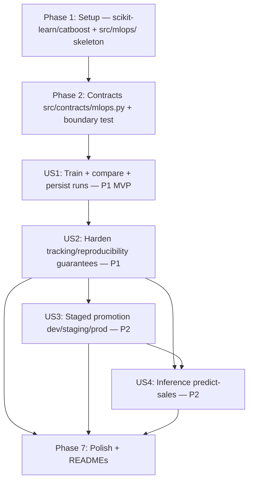

# Tasks: Sales Prediction Model (MLOps v3.0)

**Input**: Design documents from `/specs/004-sales-prediction-model/`

**Prerequisites**: plan.md (required), spec.md (required for user stories), research.md, data-model.md, contracts/, quickstart.md

**Tests**: The constitution (v1.0.0, "Development Workflow & Quality Gates") mandates contract tests at every cross-layer/cross-domain boundary and integration tests against the Dockerized PostgreSQL. These constitution-required tests are included below. Principle IV (RLS/governance) is **N/A (justificado)** for this feature per `plan.md` Constitution Check — `train-sales-model` reads the full aggregated `Orders` dataset as a batch ML job, not a per-viewer business query — so no `GovernedQueryProvider`/RLS test is required for the training path; unit tests may use fixtures/fakes for pure-ML logic, but the end-to-end CLI flows (`train-sales-model`, `predict-sales`) MUST also be validated against the real Dockerized Postgres warehouse per constitution "no mocked data stores for governance/enforcement paths" spirit and `research.md` Part G.

**Organization**: Tasks se agrupan por user story para habilitar implementación y testing independiente. Scope cubre US1 (entrenar y comparar, P1, MVP), US2 (versionar y rastrear, P1), US3 (promoción por ambiente, P2), US4 (inferencia, P2), y una fase final de polish que incluye actualización de los READMEs del root del proyecto (marcando M-MLOps como delivered, ejecutada DESPUÉS de la implementación y validación).

## Format: `[ID] [P?] [Story] Description`

- **[P]**: Can run in parallel (different files, no dependencies on incomplete tasks)
- **[Story]**: Which user story this task belongs to (US1, US2, US3, US4, READMES)
- Include exact file paths in descriptions

## Path Conventions

Single project layout per `plan.md` § Project Structure: `src/`, `tests/`, `docker/`, `.artifacts/`, at repository root. New third engineering domain `src/mlops/` added alongside existing `src/data_engineering/` and `src/ai_engineering/`. New `src/contracts/mlops.py` alongside existing contracts. New `.artifacts/mlops/` filesystem-based artifact registry (parallel to `.artifacts/load_manifest.json`/`semantic_layer.json` from prior features).

---

## Phase 1: Setup (Shared Infrastructure)

**Purpose**: Agregar las dependencias nuevas (`scikit-learn`, `catboost`) y el skeleton del paquete `src/mlops/`.

- [X] T001 [P] Add `scikit-learn>=1.9` and `catboost>=1.2.10` to `pyproject.toml` `[project.dependencies]`; run `uv sync` to regenerate `uv.lock` per `research.md` Part D / FR-029
- [X] T002 [P] Create `src/mlops/` package skeleton with `src/mlops/__init__.py` per `plan.md` Project Structure (third isolated engineering domain, parallel to `data_engineering`/`ai_engineering`)
- [X] T003 [P] Add `.artifacts/mlops/models/` and `.artifacts/mlops/predict_sales.log` to `.gitignore` (generated per-run binary artifacts and the inference log are never committed; `.artifacts/mlops/registry.json` is also runtime-generated and excluded, consistent with local-artifact conventions) per `data-model.md` § "New artifact directory entries" / `research.md` Part C

**Checkpoint**: New dependencies installed + `src/mlops/` package skeleton exists + generated artifact paths excluded from VCS

---

## Phase 2: Foundational (Blocking Prerequisites)

**Purpose**: Contract models del dominio MLOps que TODOS los user stories dependen, más la extensión del boundary test que enforza el aislamiento del dominio (Principle II/III).

**⚠️ CRITICAL**: No user story work can begin until this phase is complete

- [X] T004 [P] Define Pydantic v2 frozen contract models in `src/contracts/mlops.py` (`SalesFeatureRow`, `FeatureSet`, `ModelRunMetadata`, `EvaluationMetrics`, `ArtifactRegistryEntry`, `PromotionRecord`, `ArtifactRegistryDocument`, `PredictionInput`, `PredictionResult`) per `data-model.md` §§ 1–8 — all `frozen=True`, with validation rules: `order_dow ∈ [0,6]`, `order_month ∈ [1,12]`, `order_day_of_month ∈ [1,31]`, `quantity >= 0`, `sales`/`predicted_sales` `>= 0` where applicable, `FeatureSet.row_count == len(rows)` invariant (`model_validator`), `rmse >= 0`/`mae >= 0`, `PromotionRecord.bypassed_staging_gate=True` only valid when `environment == "prod"` (`model_validator`) per FR-005 / FR-027
- [X] T005 [P] Contract test for MLOps models in `tests/contract/test_mlops.py` (assert every model in `src/contracts/mlops.py` is Pydantic v2 frozen with explicit field types; construct valid/invalid `SalesFeatureRow`/`FeatureSet`/`PromotionRecord` fixtures to exercise the validation rules above; assert `ArtifactRegistryDocument` round-trips through `model_validate_json(model_dump_json())`) per FR-005 / FR-027 — constitution-mandated
- [X] T006 Extend boundary test in `tests/contract/test_boundaries.py` to assert: (a) `sklearn`/`catboost` imports are confined to `src/mlops/*.py` (new confinement rule, analogous to `pandas`/`openpyxl` → `data_engineering` and `openai` → `ai_engineering`); (b) no module under `src/mlops/` imports `psycopg` (directly or transitively) or `src.data_engineering.*`/`src.ai_engineering.*` internals (only `src/contracts/*` and `src/data_access/interfaces.py` are allowed dependencies, Principle II/III); (c) every model defined in `src/contracts/mlops.py` is Pydantic v2 frozen (AST/introspection check) per `contracts/mlops_training.md` § Domain boundary rules / FR-001 / FR-026

**Checkpoint**: Typed contracts + boundary enforcement extended; user story implementation can now begin

---

## Phase 3: User Story 1 — Entrenar y comparar los dos modelos de predicción de Sales (Priority: P1) 🎯 MVP

**Goal**: Un Data Scientist ejecuta `train-sales-model` una vez y obtiene ambos modelos (`LinearRegression` baseline, `CatBoostRegressor`) entrenados sobre el mismo split cronológico, evaluados con las mismas métricas, y persistidos como runs versionados (FR-006..FR-013, FR-016 aplicado desde el inicio para no reescribir la persistencia después).

**Independent Test**: Con el warehouse Postgres corriendo con `Orders` cargada, ejecutar `train-sales-model` y verificar que produce dos runs persistidos (uno por modelo) con métricas (RMSE, MAE, R²) sobre el mismo test set cronológico, y que el CLI imprime una tabla comparativa legible con el mejor RMSE señalado.

### Implementation for User Story 1

- [X] T007 [P] [US1] Implement `src/mlops/features.py` (`derive_training_row(order: OrderRow) -> SalesFeatureRow`, `derive_prediction_row(input_row: PredictionInput) -> SalesFeatureRow`, both delegating to shared private helpers `_derive_temporal_features(order_date)` and `_derive_has_discount(discount)` — single source of truth per FR-023) per `contracts/mlops_training.md` § `src/mlops/features.py` / FR-002 / FR-003
- [X] T008 [P] [US1] Implement `src/mlops/dataset.py::extract_feature_set(query_provider, orders_table_def) -> FeatureSet` (reads `Orders` via `QueryProvider.execute_readonly_query` with a literal read-only SQL validated by the existing `SqlValidator` per `research.md` Part G; maps each `QueryRow` to `SalesFeatureRow` via `features.py`; sorts deterministically by `order_date`; computes the canonical SHA-256 `data_hash` per `research.md` Part E; raises a clear typed error, no partial state, if Postgres is unreachable) per `contracts/mlops_training.md` § `src/mlops/dataset.py` / FR-001 / FR-013 / Edge Cases ("Postgres no disponible")
- [X] T009 [P] [US1] Implement `src/mlops/split.py::chronological_split(rows, test_fraction=0.2, min_test_rows=500) -> tuple[list[SalesFeatureRow], list[SalesFeatureRow]]` (sorts by `order_date` ascending, cuts by row-proportion — NEVER shuffles; raises `ValueError` with an actionable message if the resulting test set would have fewer than `min_test_rows` rows) per `contracts/mlops_training.md` § `src/mlops/split.py` / `research.md` Part B / FR-006 / Edge Cases ("test set cronológico demasiado pequeño")
- [X] T010 [P] [US1] Implement `src/mlops/encoding.py::FrequencyRareBucketEncoder` (sklearn-compatible `BaseEstimator`/`TransformerMixin`; `fit` learns per-category relative frequency + an aggregated "other" bucket frequency for infrequent categories; `transform` replaces each categorical value with its learned frequency, mapping unseen/rare categories to the "other" bucket frequency — deterministic, single numeric column per high-cardinality feature) per `research.md` Part A / FR-007
- [X] T011 [US1] Implement `src/mlops/linear_model.py` (`build_pipeline(hyperparameters) -> Pipeline` with a `ColumnTransformer`: `OneHotEncoder(handle_unknown="ignore")` for low/mid-cardinality columns, `FrequencyRareBucketEncoder` from `encoding.py` for `product_id`/`product_name`/`city`/`state`; `fit_linear_model(train_rows, hyperparameters) -> tuple[Pipeline, ModelRunMetadata]`) per `contracts/mlops_training.md` § `src/mlops/linear_model.py` / FR-007 — depends on T007, T010
- [X] T012 [P] [US1] Implement `src/mlops/catboost_model.py::fit_catboost_model(train_rows, hyperparameters) -> tuple[CatBoostRegressor, ModelRunMetadata]` (converts rows to CatBoost's feature matrix + target array + `cat_features` index list covering ALL 11 categorical columns natively, no manual encoding) per `contracts/mlops_training.md` § `src/mlops/catboost_model.py` / FR-008 — depends on T007, independent file from T011
- [X] T013 [P] [US1] Implement `src/mlops/evaluation.py::evaluate(model, test_rows, split_cutoff_date) -> EvaluationMetrics` (predicts on `test_rows` excluding `sales` from the input matrix; computes RMSE/MAE/R²; polymorphic over any `.predict(X)`-exposing object, works identically for `Pipeline` and `CatBoostRegressor`) per `contracts/mlops_training.md` § `src/mlops/evaluation.py` / FR-011
- [X] T014 [US1] Implement `src/mlops/registry.py::ArtifactRegistry` with `__init__(root=Path(".artifacts/mlops"))`, `persist_run(model_name, fitted_model, run_metadata, metrics) -> ArtifactRegistryEntry` (generates a fresh unique `run_id`; serializes the model via `joblib.dump` for `linear_regression`/`model.joblib` or `CatBoostRegressor.save_model` for `catboost`/`model.cbm`; writes `params.json`/`metrics.json`/`data_hash.txt` + the model artifact using a temp-then-rename pattern so a crash mid-write never leaves a partial run visible; appends a summary entry to `registry.json` atomically) and `list_runs(model_name=None) -> list[ArtifactRegistryEntry]` (reads ONLY `registry.json`, never deserializes the model, ordered by `trained_at` descending) per `contracts/mlops_registry.md` § `ArtifactRegistry.persist_run`/`list_runs` / FR-013 / FR-015 / FR-016
- [X] T015 [US1] Implement `src/mlops/training.py::train_sales_models(query_provider, orders_table_def, registry, linear_hyperparameters=None, catboost_hyperparameters=None, test_fraction=0.2, min_test_rows=500) -> tuple[ArtifactRegistryEntry, ArtifactRegistryEntry]` (orchestrates extract → split → fit both models → evaluate both → persist both runs via `registry.persist_run`; applies documented default hyperparameters when omitted, always recorded in `ModelRunMetadata.hyperparameters` for reproducibility) per `contracts/mlops_training.md` § `src/mlops/training.py` / FR-009 / FR-010 / FR-014 — depends on T008–T014
- [X] T016 [US1] Add `train-sales-model` CLI command in `src/cli/main.py::cmd_train_sales_model` (composition root: wires `PostgresRepository` as the `QueryProvider`, constructs `ArtifactRegistry`, calls `train_sales_models`, prints a side-by-side comparison table of RMSE/MAE/R²/training time for both models and identifies the better RMSE) per `quickstart.md` § Scenario 1 / FR-010 / FR-012 / SC-001
- [X] T017 [P] [US1] Unit test for feature engineering in `tests/unit/test_mlops_features.py` (pure, no DB: temporal features from known `order_date` values incl. `is_weekend` for Sat/Sun; `has_discount` true/false/negative-discount anomaly case; `derive_training_row`/`derive_prediction_row` route through the same private helpers — no train/serve skew) per FR-002 / FR-003 / FR-023
- [X] T018 [P] [US1] Unit test for chronological split in `tests/unit/test_mlops_split.py` (asserts no shuffle — train rows all precede test rows by `order_date`; correct proportion cutoff for `test_fraction`; raises `ValueError` when the dataset is too small for `min_test_rows`) per `research.md` Part B / FR-006 / Edge Cases
- [X] T019 [P] [US1] Unit test for the high-cardinality encoder in `tests/unit/test_mlops_encoding.py` (`FrequencyRareBucketEncoder.fit`/`transform`: known vocabulary frequencies, infrequent categories collapse into the "other" bucket, an unseen category at `transform` time maps to the "other" bucket frequency without raising) per `research.md` Part A / FR-007
- [X] T020 [US1] Integration test `tests/integration/test_mlops_training.py` (skipped without Docker PG) — runs `train-sales-model` end-to-end against the real Dockerized PostgreSQL warehouse; asserts both models are trained on the identical chronological split, RMSE/MAE/R² are computed for both, two distinct `run_id`s are persisted under `.artifacts/mlops/models/{linear_regression,catboost}/`, and that stopping the Postgres container beforehand makes the command fail fast without leaving a partial run in `registry.json` per US1 Acceptance Scenarios 1–2 / Edge Cases ("Postgres no disponible") / FR-016

**Checkpoint**: US1 fully functional — `train-sales-model` produces a reproducible, side-by-side comparison and persists both runs; this is the recommended MVP scope

---

## Phase 4: User Story 2 — Versionar y rastrear cada corrida de entrenamiento (Priority: P1)

**Goal**: Reforzar y verificar explícitamente las garantías constitucionales (Principle V) que US1 ya ejercitó de forma incidental: unicidad de `run_id`, todo-o-nada por run, inspección del registry sin deserializar el modelo, y reproducibilidad byte-exacta de métricas dado el mismo `data_hash` + hiperparámetros.

**Independent Test**: Ejecutar `train-sales-model` dos veces con datos o hiperparámetros distintos; inspeccionar el artifact registry y confirmar dos `run_id` distintos, cada uno con su propio directorio conteniendo `params.json`/`metrics.json`/`data_hash.txt`/el artifact serializado — inspeccionable vía `cat`/`ls` sin deserializar el modelo.

### Implementation for User Story 2

- [X] T021 [US2] Harden `src/mlops/registry.py::ArtifactRegistry.persist_run` with explicit `run_id` uniqueness enforcement (collision retry/regeneration) and `ArtifactRegistryDocument` schema validation (`model_validate_json`) on every `registry.json` read AND write, so a corrupted or partially-written manifest is NEVER silently accepted per `data-model.md` § "registry.json" / FR-013 / FR-015 / FR-016
- [X] T022 [P] [US2] Unit test `tests/unit/test_mlops_registry.py` (`persist_run` writes all four expected files per run; a simulated mid-write failure — e.g. monkeypatching the model serialization step to raise — leaves the PREVIOUS valid `registry.json` untouched, never a half-written one; `list_runs` never opens `model.joblib`/`model.cbm`; two `persist_run` calls never produce the same `run_id`) per `contracts/mlops_registry.md` § Domain boundary rules / FR-016 / US2 Acceptance Scenario 4
- [X] T023 [US2] Integration test `tests/integration/test_mlops_reproducibility.py` (skipped without Docker PG) — runs `train-sales-model` twice against the same Dockerized PostgreSQL state without changing hyperparameters; asserts both runs' `data_hash.txt` are byte-identical and both runs' `metrics.json` (RMSE/MAE/R²) are byte-identical, analogous to `tests/integration/test_reproducibility.py` from `001` per US1 Acceptance Scenario 3 / US2 Acceptance Scenario 2 / FR-014 / SC-003

**Checkpoint**: US2 fully functional — every run is versioned, traceable, inspectable without deserialization, and reproducibility is verified end-to-end

---

## Phase 5: User Story 3 — Promover un modelo entrenado a un ambiente (dev → staging → prod) (Priority: P2)

**Goal**: Un MLOps Engineer marca explícitamente un `run_id` como el modelo activo de un ambiente, con un gate que rechaza la promoción directa a `prod` sin pasar antes por `staging` (salvo bypass explícito y logueado), preservando el historial completo de promociones.

**Independent Test**: Entrenar un modelo (US1), promoverlo a `staging` con `promote-sales-model --run-id <id> --env staging`, y verificar que `registry.json` refleja `staging → <run_id>` y que un intento de promover directamente a `prod` sin pasar antes por `staging` es rechazado (o exige `--force` con warning de gobernanza).

### Implementation for User Story 3

- [X] T024 [US3] Implement `promote()` method on `src/mlops/registry.py::ArtifactRegistry` (`promote(run_id, environment, force_bypass_staging_gate=False) -> PromotionRecord` — validates `run_id` exists, raising a typed error listing available `run_id`s if not; enforces the staging gate for `environment="prod"` unless `force_bypass_staging_gate=True`, in which case `PromotionRecord.bypassed_staging_gate=True`; appends — never overwrites — the record to `registry.json::promotion_history`, atomically) per `contracts/mlops_registry.md` § `ArtifactRegistry.promote` / Promotion gate semantics table / FR-017 / FR-018 / FR-019 / FR-020
- [X] T025 [US3] Add `promote-sales-model` CLI command in `src/cli/main.py::cmd_promote_sales_model` (`--run-id`, `--env {dev,staging,prod}`, `--force`; on a bypass, logs an explicit governance event — analogous to the `gov_bypass` field already logged by `ai_engineering/pipeline.py` — to make the bypass auditable) per `quickstart.md` § Scenario 3 / FR-018
- [X] T026 [P] [US3] Unit test `tests/unit/test_mlops_registry.py` extension (promote to `dev`/`staging` always allowed; promote to `prod` without prior `staging` promotion is REJECTED; the same rejected promotion succeeds with `force_bypass_staging_gate=True` and sets `bypassed_staging_gate=True`; re-promoting a new `run_id` to an environment preserves the prior `PromotionRecord` in history rather than deleting it; promoting a nonexistent `run_id` raises listing available `run_id`s) per `contracts/mlops_registry.md` § Promotion gate semantics table / US3 Acceptance Scenarios 1–4
- [X] T027 [P] [US3] CLI-level unit test `tests/unit/test_cli_mlops.py` (NEW, no Docker required) — invoking `promote-sales-model --run-id does-not-exist --env dev` exits non-zero with the available `run_id`s listed; invoking `promote-sales-model --run-id <valid> --env prod` without a prior `staging` promotion exits non-zero with a clear staging-gate message; `--force` bypasses and exits `0` per FR-018 / FR-020 / US3 Acceptance Scenarios 2–3

**Checkpoint**: US3 fully functional — staged promotion is enforced with a full, non-destructible audit trail

---

## Phase 6: User Story 4 — Predecir Sales usando el modelo promovido de un ambiente (Priority: P2)

**Goal**: Un usuario obtiene una predicción de `Sales` para una orden hipotética usando el modelo actualmente promovido en un ambiente, reutilizando el mismo código de feature engineering que el entrenamiento (sin train/serve skew), sin fallar ante categorías no vistas.

**Independent Test**: Con un `run_id` promovido a `dev`, ejecutar `predict-sales --env dev` con un input tipado y verificar que devuelve una predicción numérica de `Sales` junto con metadata del modelo usado (`run_id`, `model_name`).

### Implementation for User Story 4

- [X] T028 [US4] Implement `resolve_active_run()` and `load_model()` methods on `src/mlops/registry.py::ArtifactRegistry` (`resolve_active_run(environment) -> ArtifactRegistryEntry | None` returns the most recent `PromotionRecord` for that environment, or `None`; `load_model(entry) -> Union[Pipeline, CatBoostRegressor]` deserializes `model.joblib`/`model.cbm` dispatched by `entry.model_name` — called ONLY by `inference.py`, never by `list_runs`/`promote`) per `contracts/mlops_registry.md` § `ArtifactRegistry.resolve_active_run`/`load_model` / FR-015 / FR-022
- [X] T029 [US4] Implement `src/mlops/inference.py::predict_sales(registry, environment, prediction_input) -> PredictionResult` (resolves the active run — raises a typed, clear error if `None`, FR-022; loads the model; derives `SalesFeatureRow` via `features.py::derive_prediction_row` — FR-023, no reimplementation; builds the model's expected input matrix; computes `used_fallback_encoding` via `_check_unseen_categories` comparing the input's categorical values against the vocabulary learned at training time — MUST NOT raise on unseen categories, FR-024; rounds `predicted_sales` to 2 decimals; measures `latency_ms`; logs the call — timestamp, input, prediction, `run_id`, `model_name`, `used_fallback_encoding`, `latency_ms` — to `.artifacts/mlops/predict_sales.log`) per `contracts/mlops_inference.md` / FR-021 / FR-023 / FR-024 / FR-025 — depends on T028
- [X] T030 [US4] Add `predict-sales` CLI command in `src/cli/main.py::cmd_predict_sales` (`--env {dev,staging,prod}` plus the 12 `PredictionInput` fields — ship-mode, segment, city, state, country, region, market, product-id, product-name, sub-category, category, quantity, discount, order-date; prints `predicted_sales`, `model_name`, `run_id`, `environment`, `used_fallback_encoding`, `latency_ms`) per `quickstart.md` § Scenario 4 / FR-021
- [X] T031 [P] [US4] Unit test in `_check_unseen_categories` covered by `tests/unit/test_mlops_registry.py` or a dedicated `tests/unit/test_mlops_inference.py` (deterministic, side-effect-free: same `feature_row` + same loaded model artifact always returns the same boolean; a fixture model trained on a small known vocabulary correctly flags an unseen `product_id`) per `contracts/mlops_inference.md` § Unseen-category detection contract
- [X] T032 [P] [US4] CLI-level unit test `tests/unit/test_cli_mlops.py` extension (invoking `predict-sales --env <env-without-a-promoted-model>` exits non-zero with a clear "no active model" message, no Docker required) per FR-022 / US4 Acceptance Scenario 2
- [X] T033 [US4] Integration test `tests/integration/test_mlops_inference.py` (skipped without Docker PG) — trains and promotes a model to `dev` (or reuses fixtures from US1–US3), runs `predict-sales --env dev` with a valid input and asserts a numeric `predicted_sales` + `latency_ms < 2000` (SC-006) + a new line appended to `.artifacts/mlops/predict_sales.log`; runs a second prediction with a never-seen `product_id`/`product_name` and asserts exit code `0` with `used_fallback_encoding=true` (no unhandled exception) per `quickstart.md` § Scenario 4 / Scenario 4b / FR-024 / SC-006 / SC-007

**Checkpoint**: US4 fully functional — end-to-end `train → promote → predict` workflow works against the real warehouse, with a documented, testable fallback for unseen categories

---

## Phase 7: Polish & Documentation Updates (Cross-Cutting)

**Purpose**: Cerrar calidad transversal (quickstart validation, `mypy --strict`) y, **solo después de que la implementación esté validada**, actualizar los READMEs del root del proyecto para reflejar v3.0 (MLOps) como entregado.

- [X] T034 [P] Run `quickstart.md` end-to-end validation (Scenarios 1–4c: train-sales-model comparison + reproducibility check, registry inspection without deserializing, staged promotion incl. rejected direct-to-prod and `--force` bypass, prediction incl. unseen-category fallback and no-promoted-model failure) per `quickstart.md` / SC-001 through SC-007
- [X] T035 [P] Final `mypy --strict` pass across `src/mlops/`, `src/contracts/mlops.py`, `src/cli/main.py`, and `tests/` (zero errors; any new `Any` requires inline justification per constitution Principle I, consistent with the existing `QueryRow.data: dict[str, Any]` precedent) per FR-028 / SC-008
- [X] T036 [P] Confirm domain isolation end-to-end: no `psycopg` import and no `src.data_engineering`/`src.ai_engineering` internal import anywhere under `src/mlops/` (re-run `tests/contract/test_boundaries.py` T006 as final gate) per FR-026 / SC-008
- [X] T037 [READMES] **(AFTER T034–T036 pass)** Update `README.md` (root) — bump status to v3.0 MLOps; add a "Sales Prediction Model (MLOps v3.0)" section describing the training/versioning/promotion/inference flow; add `train-sales-model`, `promote-sales-model`, `predict-sales` to Quickstart commands; add `scikit-learn`/`catboost` to Prereqs/dependencies; refresh Architecture diagram to mention `src/mlops/` as the third engineering domain; refresh Roadmap (mark M-MLOps delivered) per user request / `README_STATUS.md` maintenance routine
- [X] T038 [P] [READMES] **(AFTER T034–T036 pass)** Update `README_STATUS.md` (root) — set the "Estado actual (snapshot)" date and branch to `004-sales-prediction-model` / `v3.0`; mark Milestone **M-MLOps as Completado** in the roadmap table; add a v3.0 delivery summary to "Cobertura implementada vs roadmap"; refresh "Riesgos y puntos de atención" (document Principle IV deferral for the batch training path as scoped/accepted, not a regression; document drift-monitoring as explicit v3.1+ debt); refresh Backlog table (M-MLOps → Completado); add a closing-iteration entry in the "Rutina de mantenimiento" format per user request / `README_STATUS.md` routine
- [X] T039 [P] [READMES] **(AFTER T034–T036 pass)** Update `README_SPECKIT.md` (root) — add feature `004-sales-prediction-model` to "Resumen de lo que ya hicimos con Spec Kit" numbered list (now 4 features); add a new item to "Arquitectura alineada" mentioning `src/mlops/` and `src/contracts/mlops.py` as the third isolated engineering domain; add the file-based artifact registry (`.artifacts/mlops/registry.json`) pattern + `scikit-learn`/`catboost` dependency confinement note to "Convenciones acordadas en esta baseline"; refresh "Errores comunes" with any new gotcha discovered during implementation per `README_SPECKIT.md` structure

## Dependencies

**Story completion order** (MVP first, then tracking hardening, then staged promotion, then inference):

- **Phase 2 is a hard gate**: US1 depends on the contract models (T004) and the boundary test (T006) confining `sklearn`/`catboost` to `src/mlops/`.
- **US1 → US2**: US2 hardens and formally tests (`persist_run` uniqueness/atomicity, reproducibility) the SAME `registry.py` module US1 already built and depended on for its Independent Test — US1 could not pass its own Independent Test ("produce dos runs persistidos") without a working `persist_run`, so the base implementation lives in US1 (T014) and US2 reinforces/verifies its guarantees (T021–T023) rather than re-implementing them.
- **US1/US2 → US3**: US3's `promote()` (T024) is a new method added to the SAME `src/mlops/registry.py::ArtifactRegistry` class created in US1/US2 — a run must exist and be persisted (US1) and be reliably inspectable (US2) before it can be promoted.
- **US1/US2/US3 → US4**: US4's `resolve_active_run()`/`load_model()` (T028) depend on runs existing (US1) and promotions being recorded (US3); `predict-sales` (T029) reuses `features.py::derive_prediction_row` from US1 (T007) verbatim (FR-023, no train/serve skew).
- **Phase 7 Polish + READMEs** depends on all user stories being complete and validated (T034–T036 must pass) — README updates (T037–T039) are explicitly gated to run AFTER implementation validation, not before, per the task ordering requested.

## Parallel Execution Examples

### Within US1 (after Phase 2 gate)
- **Parallel batch A**: T007 (features.py) ∥ T008 (dataset.py) ∥ T009 (split.py) ∥ T010 (encoding.py) — different files, no inter-dependency beyond the Phase 2 contracts.
- **Sequential after A**: T011 (linear_model.py, depends on T007+T010) and T012 (catboost_model.py, depends on T007) can run in parallel with each other (different files) once T007/T010 land.
- **Parallel batch B**: T013 (evaluation.py) can run alongside T011/T012 — independent file, depends only on Phase 2 contracts.
- **Sequential after B**: T014 (registry.py `persist_run`/`list_runs`) → T015 (training.py orchestrator, depends on T008–T014) → T016 (CLI command, depends on T015).
- **Parallel batch C**: T017 (features unit test) ∥ T018 (split unit test) ∥ T019 (encoding unit test) — each depends only on its own module (T007/T009/T010 respectively); different files.
- **Sequential after C**: T020 (integration test) depends on T015 + T016 + Dockerized PG.

### Within US2 (after US1 completes)
- **Sequential**: T021 (harden `persist_run` uniqueness/schema validation) must land before T022 (unit test exercising those guarantees) and T023 (reproducibility integration test, which relies on identical `data_hash`/metrics round-tripping cleanly).
- **Parallel**: T022 and T023 can run in parallel once T021 lands (different files: `tests/unit/test_mlops_registry.py` vs `tests/integration/test_mlops_reproducibility.py`).

### Within US3 (after US2 completes)
- **Sequential**: T024 (`promote()` method) → T025 (CLI command, depends on T024).
- **Parallel batch D**: T026 (registry promote unit tests) ∥ T027 (CLI-level fail-fast unit tests) — different files, both depend on T024/T025 but not on each other.

### Within US4 (after US3 completes)
- **Sequential**: T028 (`resolve_active_run`/`load_model`) → T029 (`inference.py::predict_sales`, depends on T028 + T007 from US1) → T030 (CLI command, depends on T029).
- **Parallel batch E**: T031 (unseen-category unit test) ∥ T032 (CLI-level fail-fast unit test) — different files, both depend on T029/T030.
- **Sequential after E**: T033 (integration test) depends on T029 + T030 + Dockerized PG + a promoted run from US3.

### Within Phase 7 (Polish + READMEs)
- **Parallel batch F**: T034 (quickstart e2e) ∥ T035 (mypy --strict) ∥ T036 (boundary re-check) — independent validation passes.
- **Sequential after F**: T037 (README.md) ∥ T038 (README_STATUS.md) ∥ T039 (README_SPECKIT.md) can run in parallel with EACH OTHER (three independent root README files) but only AFTER T034–T036 all pass.

## Implementation Strategy

**MVP first**: US1 alone delivers independent value — `train-sales-model` produces a reproducible, side-by-side comparison of both models plus persisted, versioned runs. It is the recommended single-story MVP scope, consistent with the spec's own 🎯 MVP flag.

**Constitutionally-required next**: US2 formalizes the Principle V guarantees (reproducibility, all-or-nothing persistence, inspectability without deserialization) that US1's Independent Test already implicitly relies on — cannot claim compliance with "experiment tracking is MANDATORY" without US2's hardening + tests.

**Governed rollout next**: US3 (staged promotion) is required before any model can be trusted in `predict-sales` without direct-to-prod risk — it builds directly on US1/US2's persisted, versioned runs.

**Consumption surface last**: US4 (inference) is the payoff — it depends on US1 (trained+persisted runs), US2 (reliable registry reads), and US3 (a promoted `run_id` to resolve), and reuses US1's feature-engineering code verbatim to avoid train/serve skew.

**Architecture adherence**: Every implementation task MUST keep `scikit-learn`/`catboost` confined to `src/mlops/*.py` (constitution Principle I/III, extending the `pandas`/`openpyxl` → `data_engineering` and `openai` → `ai_engineering` confinement pattern), keep `psycopg` confined to `data_access/adapters/postgres/repository.py` (unchanged, carried from `001`), type every signature (Principle I), route all MLOps traffic through `src/contracts/mlops.py` (Principle II), read `Orders` EXCLUSIVELY via the existing `QueryProvider` Protocol with no new methods added to it (Principle III), and treat `ArtifactRegistry` as the single owner of `.artifacts/mlops/**` (no other module touches those paths directly).

**Excluded from this feature**: HTTP/gRPC serving of `predict-sales` (out of scope, batch/CLI only); production drift monitoring/alerting (documented debt for v3.1+); a centralized/online feature store (features are recomputed on-demand); automated hyperparameter tuning/AutoML (documented, versioned defaults only); additional model families beyond `LinearRegression`/`CatBoostRegressor`; any managed cloud MLOps backend (MLflow server, S3/GCS, managed model registry); scheduled/automatic retraining (manual CLI trigger only); a `Register` feature column (does not exist in `Orders`, documented Assumption). These appear only as roadmap context in `spec.md`/`research.md`, never as tasks here.

> **Amendment (2026-08-25)**: After all tasks below were completed and
> validated, `Product Name`/`City`/`State`/`Country` were reviewed against
> `data_dictionary.md` cardinalities and dropped from the feature set for
> lacking incremental predictive signal (see `spec.md` § Amendment). Task
> descriptions below (e.g. T011, T033) still mention these columns as
> originally implemented — they reflect the state at completion time, not
> the current code. The follow-up removal touched `src/contracts/mlops.py`,
> `src/mlops/features.py`, `src/cli/main.py`, and the corresponding tests;
> full test suite (160 passed) and `mypy --strict` were re-verified green
> after the change.

## Done When

- [ ] `tasks.md` generated with all phases, task IDs, `[P]` markers, exact file paths, and user-story grouping
- [ ] Phases 1–7 cover setup, foundational, US1 (MVP), US2 (tracking), US3 (promotion), US4 (inference), and polish + READMEs
- [ ] README-update tasks (T037, T038, T039) are explicitly gated to run AFTER implementation validation (T034–T036), per user request
- [ ] Constitution Principle V (reproducible, tracked, staged-promotion MLOps) is fully covered by US2/US3 tasks and tested end-to-end
- [ ] Constitution Principle II/III domain isolation (`src/mlops/` boundary) is enforced by Phase 2's boundary test and re-verified in Phase 7
- [ ] Extension hooks: `.specify/extensions.yml` does not exist → skipped (no mandatory or optional pre/post-tasks hooks)
- [ ] Completion reported to user with task count, story breakdown, MVP scope, and README-update tasks
